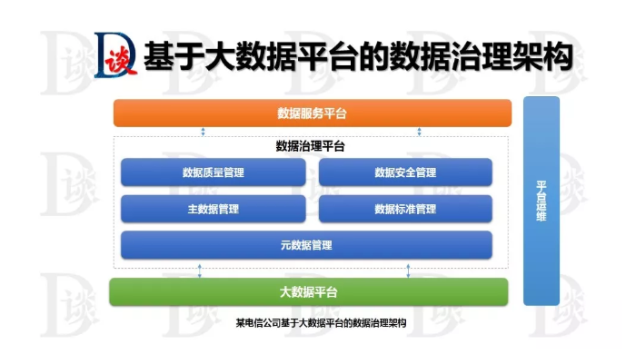
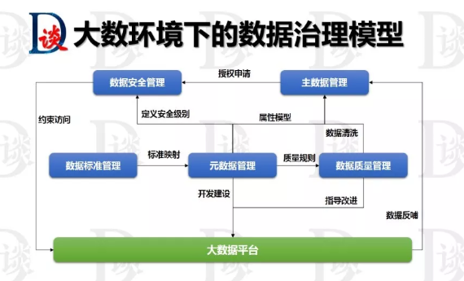
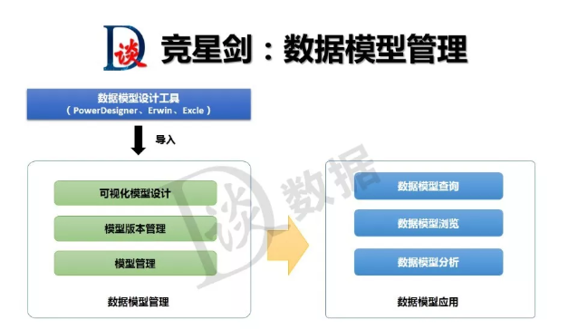
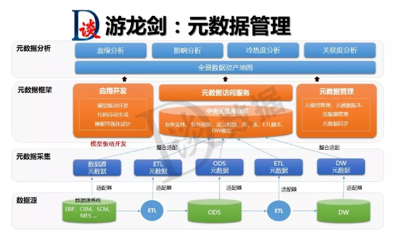
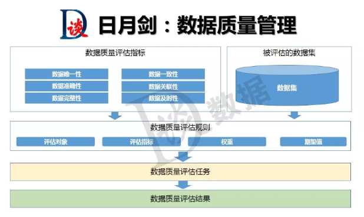
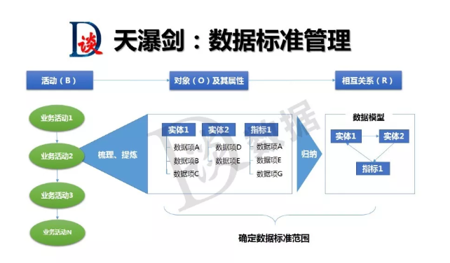
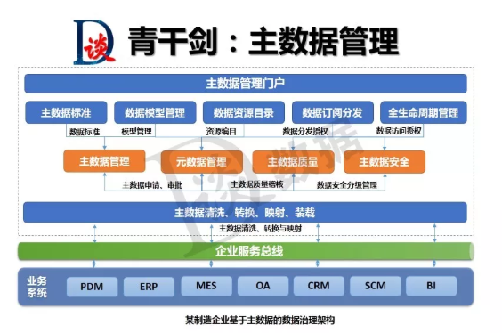
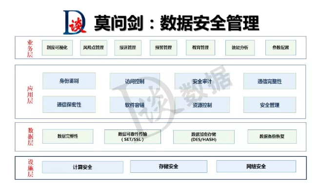
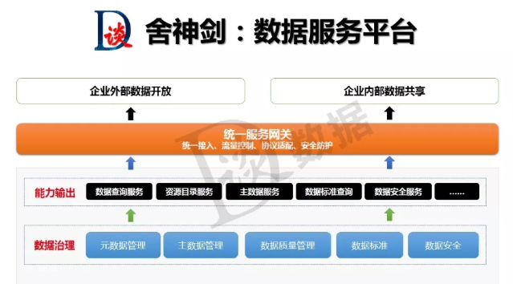
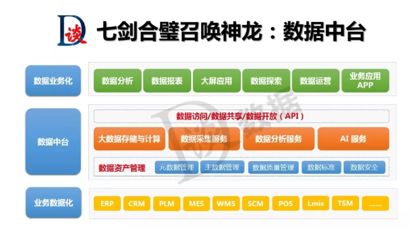

# 数据中台介绍

1. 数据中台的愿景是什么？
2. 数据管理的角色和组织级其职责和决策权是什么？
3. 数据管理方案的组成部分？

## 数据战略

数据战略就是企业为实现某些业务目标而做出的数据规划和部署，主要包括：`数据战略目标、数据战略范围和内容、数据战略实施策略、以及数据战略的实施路径和计划`，这也就是我们所说的“战略四要素”.

**数据战略范围和内容——战略定位**

战略定位是回答了“做什么”、“不做什么”的根本问题，企业数据战略定位，就是定义企业的数据管理/数据治理的范围和内容。按照DAMA的给出的数据战略范围主要包括：`数据架构、元数据管理、数据标准管理、数据质量管理、主数据和参照数据、数据安全管理`等。以上每个部分内容都可各成体系，那对企业来说，数据治理范围和内容该如何选择，却是摆在企业面前不得不回答的问题。这里，笔者建议企业的数据治理定位应充分考虑以下几点因素：企业的痛点需求是什么，希望实现的目标是什么，实施数据治理就能解这些问题吗，数据治理的投资计划（人力和资金），期望的投资回报率。把以上问题问题都想清楚了，你的数据战略定位也就清晰了——或选择全域治理、或选择个别亟待治理的主题。

## 数据架构

数据架构是对业务架构中的各项业务的关联关系的逻辑描述，并通过数据架构描述各个应用模块的数据构成、相互关系和存储方式，位于业务架构和应用架构之间，起到承上启下的作用。而我们所说的数据治理涉及的数据架构，从功能上讲，包括：`信息资源目录管理、主数据管理、元数据管理、数据质量管理、数据标准管理、数据安全管理以及数据的全生命周期管理`。

**当前流行的数据治理架构**

1. 元数据驱动的数据治理架构
2. 主数据驱动的数据治理架构
3. 微服务模式的数据治理架构
4. 基于混合云的数据治理架构
5. 大数据架构的数据治理体系

**大数据架构的数据治理体系**

在大数据时代，数据分散在整个企业中。它是结构化的、非结构化的、半结构化的和各种其他格式。随着可用数据的数量、种类和速度都在以惊人的速度持续增长。此外，数据源不在需要管理的团队的控制之下。企业面临着两个紧迫的挑战：如何发现这些数据中的可操作的洞察力，以及如何保护它。这两个挑战直接取决于数据治理的能力。

    

大数据环境下，如何实现数据的高效治理。以上是某电信公司的大数据治理架构，数据治理平台包含了元数据管理、数据质量管理、主数据管理、数据标准管理和数据安全管理。`通过数据治理平台定义大数据平台的数据结构、质量规则和数据标准，实现大数据平台的数据管控和治理。同时，大数据平台的分析结果也可以反哺数据治理平台，形成更多的可信赖数据服务`。大数据平台与数据治理平台各模块之间的关系如下：

    

## 技术与工具

数据治理本质是盘点数据资产、治理数据质量，实施数据全生命周期的管理，根据不同的项目特点，会用到不同的技术或工具，一般来说，数据治理产品或工具主要包含以下组件：数据模型管理、元数据管理、数据质量管理、数据标准管理、主数据管理、数据安全管理、数据服务平台。

### 数据模型管理

数据模型对上是承载数据业务需求的元数据，对下是数据标准管理的内容，同时，是数据质量指标和规则定义的起点，是主数据和参照数据设计的根本，是数据仓库和BI的核心，也是数据安全管控的对象。数据模型管理平台从功能上，主要包括：`可视化建模、模型版本管理、数据模型管理、数据模型查询、数据模型浏览、数据模型分析`等。

    

`可视化建模`。提供的可视化的前台建模能力，支持企业级数据模型的构建，数据可视化建模一般支持oracle、MySQL、SQLserver、HIVE、Hbase等数据库类型，优秀的模型管理平台支持数据仓库或业务系统的正向建模，同时支持将企业现有系统数据模型反向采集。

`模型版本管理`。支持模型变更和版本的管理，支持版本的回溯，版本明细信息查询。

`数据模型管理`。支持模型导入功能，对于采用PowerDesigner、Erwin、Excle等模型设计工具设计的模型能够导入到模型管理平台中来，并提供模型的可视化修改、模型导出、模型删除等功能。

`数据模型查询`。支持数据模型查询，通过输入关键字可以查询到指定的数据模型。

`数据模型浏览`。支持数据模型全景视图，能够直观看到企业数据的分布地图，并支持通过模型下钻功能进行模型的逐级查询，直到查询的模型的最深层级的元数据。

`数据模型分析`。主要提供模型的对比分析功能，这种对比分析可以是两个不同模型之间也可以是统一模型的不同版本之间的对比分析。通过模型的对比分析，能够轻松找到模型之间的差异，支持由模型驱动的影响分析。

### 元数据管理

元数据管理统一管控分布在企业各个角落的数据资源，企业涉及的业务元数据、技术元数据、管理元数据都是其管理的范畴，按照科学、有效的机制对元数据进行管理，并面向开发人员、最终用户提供元数据服务，以满足用户的业务需求，对企业业务系统和数据分析平台的开发、维护过程提供支持。元数据管理是企业数据治理的基础，元数据管理平台从功能上，主要包括：元数据采集服务，应用开发支持服务，元数据访问服务、元数据管理服务和元数据分析服务。

    

**元数据分析服务包括**：

- 血缘分析：告诉你数据来自哪里，都经过了哪些加工。
- 影响分析：告诉你数据都去了哪里，经过了哪些加工。
- 冷热度分析：告诉你哪些数据是企业常用数据，哪些数据属于僵死数据。
- 关联度分析：告诉你数据和其他数据的关系以及它们的关系是怎样建立的。
- 数据资产地图：告诉你有哪些数据，在哪里可以找到这些数据，能用这些数据干什么

### 数据质量管理

数据质量管理工具在不同的数据治理项目中有时会被单独使用，有时配合元数据使用、有时又与主数据搭档。在管理范围上，往往会根据项目的需求、客户的目标进行控制，可以是企业级的全域数据质量管理，也可以针对某一特定业务领域进行数据质量管理的实施。数据质量管理工具从功能上，主要包括：数据质量指标管理、数据质量规则管理、数据质量评估任务、数据质量评估报告。

    

`数据质量指标管理`。通过对不同业务规则的收集、分类、抽象和概括，定义数据质量维度，这里给出了六种，分别是：数据唯一性、数据一致性、数据准确性、数据关联性、数据完整性、数据及时性。质量指标反映了数据质量不同的规格标准，也体现了高层次的指标度量的特点。

`数据治理规则管理`。一个数据质量规则包含了数据的评估对象，评估指标、权重和期望值等。质量规则是由业务人员根据各检核类别对不同的业务实体提出的数据质量的衡量标准。它是各检核类别在不同业务实体上的具体体现。

`数据质量检核任务`。检核任务调度模块是数据质量平台的核心，通过执行检核方法生成相应的检核结果问题数据文件，检核结果问题数据能够反映出用户所关心的数据质量问题。

`数据质量分析报告`。数据质量报告提供了一个集中展示数据质量状况的窗口，相关人员可以对数据质量问题进行查询、统计、分析，找到引起数据质量问题的根因，并付诸行动，从源头上解决数据质量的根本问题，实现数据质量的闭环。

### 数据标准管理

数据标准从字面上理解就是数据既定的“规则”，这个规则一旦定义，就需要必须执行。数据标准化就是研究、制定和推广应用统一的数据分类分级、记录格式及转换、编码等技术标准的过程。从管理的对象上来看，数据标准主要包含三个方面的标准：数据模型标准、即元数据的标准化；主数据和参照数据标准；指标数据标准，如指标的统计维度、计算方式、分析规则等。数据标准管理工具，从功能层面主要包括：数据标准编制、数据标准审批、数据标准发布、数据标准使用。

    

`数据标准编制`。根据企业业务进行管控数据项的划分，确定数据项的名称、编码、类型、长度、业务含义、数据来源、质量规则、安全级别、域值范围等。数据标准可以参考国际、国家或行业标准的现行标准进行制定，也可以根据企业业务制定特定的企业级数据标准。

`数据标准审查`。对数据标准初稿进行审查，判断数据标准是否符合企业的应用和管理需求，是否符合企业数据战略要求

`数据标准发布`。数据标准一经发布各部门、各业务系统都需要按相应的标准进行执行，对于遗留系统会存在一定的风险。标准发布的过程需要对现有应用系统、数据模型的影响进行评估，并做好相应的应对策略。

`数据标准贯彻`。把已定义的数据标准与业务系统、应用和服务进行映射，标明标准和现状的关系以及可能影响到的应用。该过程中，对于企业新建的系统应当直接应用定义好的数据标准，对于旧系统应对一般建议建了相应的数据映射关系，进行数据转换，逐步进行数据标准的落地。

### 主数据管理

主数据管理平台从功能上主要包括：主数据模型、主数据编码、主数据管理、主数据清洗、主数据质量、主数据集成等。

    

`主数据模型`。提供主数据的建模功能，管理主数据的逻辑模型和物理模型以及各类主数据模板。

`主数据编码`。编码功能是主数据产品的初级形态，也是主数据产品的核心能力，支持各种形式主数据的编码，提供数据编码申请、审批、集成等服务。

`主数据管理`。主要提供主数据的增删改查功能。

`主数据清洗`。主要包括主数据的采集、转换、清理、装载等功能。

`主数据质量`。主要提供主数据质量从质量问题发现到质量问题处理的闭环管理功能。

`主数据集成`。主要提供主数据采集和分发服务，完成与企业其他异构系统的对接。当然，谈到集成就不得不说的一个重要工具，ESB（企业服务总线），这个工具也是经常会与主数据产品进行配合在实现企业主数据治理的同时，解决企业异构系统的集成问题。

### 数据安全管理

    

### 数据服务平台

    

### 数据中台

    

