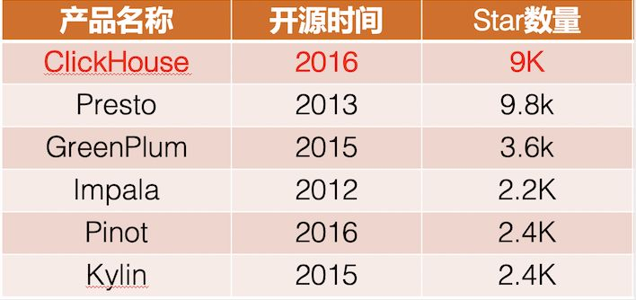

GreenPlum 类似于 TiDB，只不过是基于 PG 协议的；

Kudu是cloudera开源的运行在hadoop平台上的列式存储系统,拥有Hadoop生态系统应用的常见技术特性，运行在一般的商用硬件上，支持水平扩展,高可用.

Presto是一个facebook开源的分布式SQL查询引擎，适用于交互式分析查询；

Impala 在 hadoop 平台提供低延迟、高性能的 BI 分析查询。

Drill supports a variety of NoSQL databases and file systems, including HBase, MongoDB, MapR-DB, HDFS, MapR-FS, Amazon S3, Azure Blob Storage, Google Cloud Storage, Swift, NAS and local files. 

HAWQ是Hadoop原生SQL查询引擎，结合了MPP数据库的关键技术优势和Hadoop的可扩展性和便捷性。HAWQ从HDFS本地读取数据并将数据写入HDFS。

Druid是为快速查询和接收非常重要的工作流而设计的；

Pinot 是一个实时分布式的 OLAP 数据存储和分析系统。使用它实现低延迟可伸缩的实时分析。Pinot 从离线数据源（包括 Hadoop 和各类文件）和在线数据源（如 Kafka）中攫取数据进行分析。Pinot 被设计是可以进行水平扩展的。特别适合这样的数据分析场景：查询具有大量维度和指标的时间序列数据，分析模型固定，数据只追加以及低延迟，以及分析结果可查询。

Apache Kylin™是一个开源的、分布式的分析型数据仓库，提供Hadoop/Spark 之上的 SQL 查询接口及多维分析（OLAP）能力以支持超大规模数据，最初由 eBay 开发并贡献至开源社区。它能在亚秒内查询巨大的表。

ClickHouse是一款用于大数据实时分析的列式数据库管理系统，而非数据库。通过向量化执行以及对CPU底层指令集（SIMD）的使用，它可以对海量数据进行并行处理，从而加快数据的处理速度。

    

