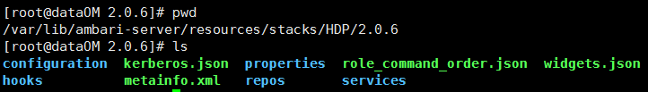

# ambari 自定义 stacks 与 services
> https://cwiki.apache.org/confluence/display/AMBARI/How-To+Define+Stacks+and+Services#How-ToDefineStacksandServices-RoleCommandOrder

stack 是一系列服务的集合，stack 可以存在多个版本，每个版本都有自己的服务集合。Ambari 中 Stacks 在 `ambari-server/src/main/resources/stacks` 文件夹内定义, 安装后可以在 `/var/lib/ambari-server/resources/stacks` 目录中找到。

Stack 管理的服务可以在 `/var/lib/ambari-server/resources/common-services` 或者 `/var/lib/ambari-server/resources/stacks` 目录下。

> 问题: 什么时候该把服务定义在 `common-services` 而不是 `stacks` 目录下?
>
> 当有多个版本的 stacks 都需要某个服务时，将其定义在 common-services 目录下. 例如几乎所有版本的 stacks 都需要 HDFS，与其在每个版本 stacks 中重新定义，不如在 common-services 中定义一个。如果一个服务永远不会被共享，那就可以定义在 stacks 目录下。

## Stack Properties

ambari-server/resources/stacks/HDP/2.0.6/properties 目录下必须包含：`stack_features.json and stack_tools.json`,并且不能这两个配置文件不能存在于其他版本下，如不能存在于 HDP/2.1/目录下。

`stack_features.json` 包含一系列的特征，每个特征包含名称、描述以及支持的最低版本与最高版本，例子如下：
```json
{
  "stack_features": [
    {
      "name": "snappy",
      "description": "Snappy compressor/decompressor support",
      "min_version": "2.0.0.0",
      "max_version": "2.2.0.0"
    }
  ]
}
```

stack_tools.json 包含 `stack_selector` and `conf_selector` 工具安装的名称与位置信息，如下：
```json
{
  "stack_selector": ["hdp-select", "/usr/bin/hdp-select", "hdp-select"],
  "conf_selector": ["conf-select", "/usr/bin/conf-select", "conf-select"]
}
```

## Structure

stack 定义的结构如下：
```
|_ stacks
   |_ <stack_name>
      |_ <stack_version>
         metainfo.xml
         |_ hooks
         |_ repos
            repoinfo.xml
         |_ services
            |_ <service_name>
               metainfo.xml
               metrics.json
               |_ configuration
                  {configuration files}
               |_ package
                  {files, scripts, templates}
```
真实环境如下：

<div align="center">
    
</div>

## 自定义服务与组件

**metainfo.xml**

描述了这个服务、这个服务中的组件以及用户执行命令的脚本，是一个 `核心` 文件。服务的组件可以是 MASTER、SLAVE、CLIENT 分类，标签 <category> 告诉 Ambari 哪个默认命令应该被获得，用于管理和监控组件。每个组件通过指定 <commandScript> 来执行命令. There is a defined set of default commands the component must support. 

 | component category | default lifecycle commands              |
 | ------------------ | --------------------------------------- |
 | MASTER             | install, start, stop, configure, status |
 | SLAVE              | install, start, stop, configure, status |
 | CLIENT             | install, configure, status              |

 Ambari 支持用 PYTHON 写的不同命令脚本， 你也可以创建自定义命令而不是默认的生命周期命令，用于支持你的组件。例如 Yarn 的组件 ResourceManager 组件在 metainfo.xml 中的描述如下：

 ```xml
 <component>
  <name>RESOURCEMANAGER</name>
  <category>MASTER</category>
  <commandScript>
    <script>scripts/resourcemanager.py</script>
    <scriptType>PYTHON</scriptType>
    <timeout>600</timeout>
  </commandScript>
  <customCommands>
    <customCommand>
      <name>DECOMMISSION</name>
      <commandScript>
        <script>scripts/resourcemanager.py</script>
        <scriptType>PYTHON</scriptType>
        <timeout>600</timeout>
      </commandScript>
    </customCommand>
  </customCommands>
</component>
```

The ResourceManager is a `MASTER` component, and the command script is `scripts/resourcemanager.py`, which can be found in the `services/YARN/`package directory. That command script is `PYTHON` and that script implements the default lifecycle commands as python methods. This is the install method for the default `INSTALL` command:
```python
class Resourcemanager(Script):
  def install(self, env):
    self.install_packages(env)
    self.configure(env)
```
You can also see a custom command is defined `DECOMMISSION`, which means there is also a `decommission` method in that python command script:
```python
def decommission(self, env):
  import params
 
  ...
 
  Execute(yarn_refresh_cmd,
          user=yarn_user
  )
  pass
```

## Using Stack Inheritance

为了共享命令脚本和配置，Stacks 可以继承其他 Stacks，通过以下步骤可以减少跨 Stacks 的代码：
1. 为子 Stack 定义 repositories
2. 在子 Stack 中添加新服务
3. 覆盖父服务的命令脚本
4. 覆盖父服务的配置文件

For example, the `HDP 2.1 Stack extends HDP 2.0.6 Stack` so only the changes applicable to HDP 2.1 Stack are present in that Stack definition. This extension is defined in the `metainfo.xml` for HDP 2.1 Stack:
```xml
<metainfo>
  <versions>
    <active>true</active>
  </versions>
  <extends>2.0.6</extends>
</metainfo>
```

## 自定义服务案例
> In this example, we will create a custom service called "SAMPLESRV", add it to an existing Stack definition. This service includes MASTER, SLAVE and CLIENT components.

```shell
# 创建对应目录
cd /var/lib/ambari-server/resources/stacks/HDP/2.0.6/services
mkdir /var/lib/ambari-server/resources/stacks/HDP/2.0.6/services/SAMPLESRV
cd /var/lib/ambari-server/resources/stacks/HDP/2.0.6/services/SAMPLESRV
```
创建 metainfo.xml, 并编辑如下：
```xml
<?xml version="1.0"?>
<metainfo>
    <schemaVersion>2.0</schemaVersion>
    <services>
        <service>
            <name>SAMPLESRV</name>
            <displayName>New Sample Service</displayName>
            <comment>A New Sample Service</comment>
            <version>1.0.0</version>
            <components>
                <component>
                    <name>SAMPLESRV_MASTER</name>
                    <displayName>Sample Srv Master</displayName>
                    <category>MASTER</category>
                    <cardinality>1</cardinality>
                    <commandScript>
                        <script>scripts/master.py</script>
                        <scriptType>PYTHON</scriptType>
                        <timeout>600</timeout>
                    </commandScript>
                </component>
                <component>
                    <name>SAMPLESRV_SLAVE</name>
                    <displayName>Sample Srv Slave</displayName>
                    <category>SLAVE</category>
                    <cardinality>1+</cardinality>
                    <commandScript>
                        <script>scripts/slave.py</script>
                        <scriptType>PYTHON</scriptType>
                        <timeout>600</timeout>
                    </commandScript>
                </component>
                <component>
                    <name>SAMPLESRV_CLIENT</name>
                    <displayName>Sample Srv Client</displayName>
                    <category>CLIENT</category>
                    <cardinality>1+</cardinality>
                    <commandScript>
                        <script>scripts/sample_client.py</script>
                        <scriptType>PYTHON</scriptType>
                        <timeout>600</timeout>
                    </commandScript>
                </component>
            </components>
            <osSpecifics>
                <osSpecific>
                    <osFamily>any</osFamily>  <!-- note: use osType rather than osFamily for Ambari 1.5.0 and 1.5.1 -->
                </osSpecific>
            </osSpecifics>
        </service>
    </services>
</metainfo>
```

上述配置文件中，我们的服务名为 "SAMPLESRV", 包含:
- one MASTER component "SAMPLESRV_MASTER"
- one SLAVE component "SAMPLESRV_SLAVE"
- one CLIENT component "SAMPLESRV_CLIENT"

**创建对应脚本**

```shell
mkdir -p /var/lib/ambari-server/resources/stacks/HDP/2.0.6/services/SAMPLESRV/package/scripts
cd /var/lib/ambari-server/resources/stacks/HDP/2.0.6/services/SAMPLESRV/package/scripts
```
python 脚本
```python
# Master 组件
import sys
from resource_management import *
class Master(Script):
  def install(self, env):
    print 'Install the Sample Srv Master';
  def stop(self, env):
    print 'Stop the Sample Srv Master';
  def start(self, env):
    print 'Start the Sample Srv Master';
     
  def status(self, env):
    print 'Status of the Sample Srv Master';
  def configure(self, env):
    print 'Configure the Sample Srv Master';
if __name__ == "__main__":
  Master().execute()

# Slave 组件
import sys
from resource_management import *
class Slave(Script):
  def install(self, env):
    print 'Install the Sample Srv Slave';
  def stop(self, env):
    print 'Stop the Sample Srv Slave';
  def start(self, env):
    print 'Start the Sample Srv Slave';
  def status(self, env):
    print 'Status of the Sample Srv Slave';
  def configure(self, env):
    print 'Configure the Sample Srv Slave';
if __name__ == "__main__":
  Slave().execute()

# sample_client 组件
import sys
from resource_management import *
class SampleClient(Script):
  def install(self, env):
    print 'Install the Sample Srv Client';
  def configure(self, env):
    print 'Configure the Sample Srv Client';
if __name__ == "__main__":
  SampleClient().execute()
```

**重新启动Ambari服务器，以便将此新服务定义分发给群集中的所有代理**
```shell
ambari-server restart
```

## define service in common-services

目录： /var/lib/ambari-server/resources/common-services/

<div align="center">
    
</div>

文件目录：
- alerts.json: alerts.json 文件：描述 ambari 对服务的 告警 设置。告警类型有 WEB、Port、Metric、Aggregate 和 Script .
- configuration 目录: 里面放置一个或多个 xml 文件，用于将该服务的配置信息展示在前端页面，也可以在ambari 页面上对服务的一些配置做更改
- kerberos.json  
- 描述了这个服务、这个服务中的组件以及用户执行命令的脚本，是一个 `核心` 文件
- metrics.json  
- package 目录：里面包含 scripts 文件夹，该目录下存放着 python 文件，用于对服务的安装、配置、启动、停止等操作。自定义服务 python 脚本依赖的模块是 resource_management 。 
- widgets.json
- quicklinks.json 文件：用于生成快速链接，实现 url 的跳转。可支持多个 url 展示。
- role_command_order.json 文件：决定各个服务组件之间的启动顺序

<div align="center">
    
</div>

 
 目录 | 目的
 ---- | ----
 package/scripts | Contains scripts invoked by Ambari. These scripts are loaded into the execution<br> path with the correct environment. Example: HDFS
 package/files | Contains files used by above scripts. Generally these are other scripts (bash, python, etc.)<br> invoked as a separate process Example: checkWebUI.py is run in HDFS service-check to determine if Journal Nodes are available
 package/templates | Template files used by above scripts to generate files on managed hosts. These are generally<br> configuration files required by the service to operate. Example: exclude_hosts_list.j2 which is used by scripts to generate /etc/hadoop/conf/dfs.exclude

**Ambari 提供了一些有效的 python 库用于编写服务脚本**：
- resource_management
- ambari_commons
- ambari_simplejson 

**配置 configuration**

服务的配置文件默认放置在 **configuration** 文件夹. 如果使用了不同名称的目录，需要在 metainfo.xml 中使用 <configuration-dir> 指出。一些重要的配置如下：
```xml
<?xml version="1.0"?>
<metainfo>
  <schemaVersion>2.0</schemaVersion>
  <services>
    <service>
      <name>HDFS</name>
      <displayName>HDFS</displayName>
      <comment>Apache Hadoop Distributed File System</comment>
      <version>2.1.0.2.0</version>
      <components>
        ...
        <component>
          <name>HDFS_CLIENT</name>
          ...
          <configFiles>
            <configFile>
              <type>xml</type>
              <fileName>hdfs-site.xml</fileName>
              <dictionaryName>hdfs-site</dictionaryName>
            </configFile>
            <configFile>
              <type>xml</type>
              <fileName>core-site.xml</fileName>
              <dictionaryName>core-site</dictionaryName>
            </configFile>
            <configFile>
              <type>env</type>
              <fileName>log4j.properties</fileName>
              <dictionaryName>hdfs-log4j,yarn-log4j</dictionaryName>
            </configFile>                         
            <configFile>
              <type>env</type>
              <fileName>hadoop-env.sh</fileName>
              <dictionaryName>hadoop-env</dictionaryName>
            </configFile>
          </configFiles>
          ...
          <configuration-dependencies>
             <config-type>core-site</config-type>
             <config-type>hdfs-site</config-type>
          </configuration-dependencies>
        </component>
          ...
      </components>
  
      <configuration-dir>configuration</configuration-dir>
      <configuration-dependencies>
        <config-type>core-site</config-type>
        <config-type>hdfs-site</config-type>
        <config-type>hadoop-env</config-type>
        <config-type>hadoop-policy</config-type>
        <config-type>hdfs-log4j</config-type>
        <config-type>ranger-hdfs-plugin-properties</config-type>
        <config-type>ssl-client</config-type>
        <config-type>ssl-server</config-type>
        <config-type>ranger-hdfs-audit</config-type>
        <config-type>ranger-hdfs-policymgr-ssl</config-type>
        <config-type>ranger-hdfs-security</config-type>
        <config-type>ams-ssl-client</config-type>
      </configuration-dependencies>
    </service>
  </services>
</metainfo>
```

`config-type` - String representing a group of configurations. Example: core-site, hdfs-site, yarn-site, etc. When configurations are saved in Ambari, they are persisted within a version of config-type which is immutable. If you change and save HDFS core-site configs 4 times, you will have 4 versions of config-type core-site. Also, when a service's configs are saved, only the changed config-types are updated.

`configFiles `- lists the config-files handled by the enclosing component

`configFile` - represents one config-file of a certain type

`type` - type of file based on which contents are generated differently
- `xml` - XML file generated in Hadoop friendly format. Ex: hdfs-site.xml
- `env` - Generally used for scripts where the content value is used as a template. The template has config-tags whose values are populated at runtime during file
- `generation`. Ex: hadoop-env.sh
- `properties` - Generates property files where entries are in key=value format. Ex: falcon-runtime.properties

`dictionaryName` - Name of the config-type as which key/values of this config file will be stored

`configuration-dependencies` - Lists the config-types on which this component or service depends on. One of the implications of this dependency is that whenever the config-type is updated, Ambari automatically marks the component or service as requiring restart. From the code section above, whenever core-site is updated, both HDFS service as well as HDFS_CLIENT component will be marked as requiring restart.

`configuration-dir` - Directory where files listed in configFiles will be. Optional. Default value is configuration.

**Alerts**

每个服务都可以通过提供alerts.json文件来定义Ambari应该跟踪哪些警报。

**Kerberos**

Ambari能够为集群启用和禁用Kerberos。为了通知Ambari要用于服务及其组件的标识和配置，每个服务都可以提供kerberos.json文件。

**Metrics**

Ambari提供Ambari Metrics System（“AMS”）服务，用于收集、聚合和服务Ambari管理的集群中的Hadoop和系统度量。每个服务都可以通过定义Metrics.json文件来定义AMS应收集和提供的度量。

**Quick Links**

服务可以按照预定义的JSON格式向文本文件添加metainfo，从而向Ambari web UI添加快速链接列表。Ambari服务器解析quicklink JSON文件并将其内容提供给UI。因此，Ambari web UI可以根据信息计算快速链接url，并相应地填充快速链接下拉列表。

**Widgets**

每个服务都可以通过定义widgets.json文件来定义哪些小部件和热图默认显示在服务摘要页面上。

**Role Command Order**

在Ambari 2.2中，每个服务都可以通过在其服务文件夹中包含role_command_order.json文件来定义自己的role command order。服务应该只指定其组件与其他组件的关系。换言之，如果一个服务只包含COMP_X，那么它应该只列出与COMP_X相关的依赖项。如果COMP_X启动时依赖于NameNode启动，而NameNode停止时应该等待COMP_X停止，role命令顺序中将包括以下内容：

```json
// Example service role_command_order.json
"COMP_X-START": ["NAMENODE-START"],
"NAMENODE-STOP": ["COMP_X-STOP"]
```


