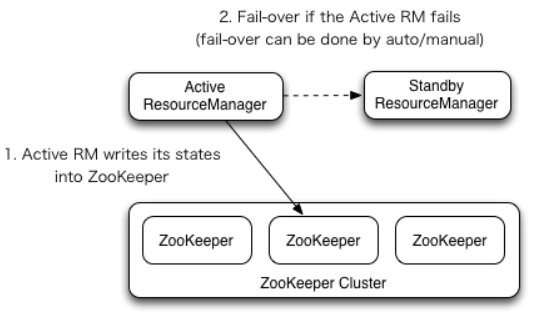
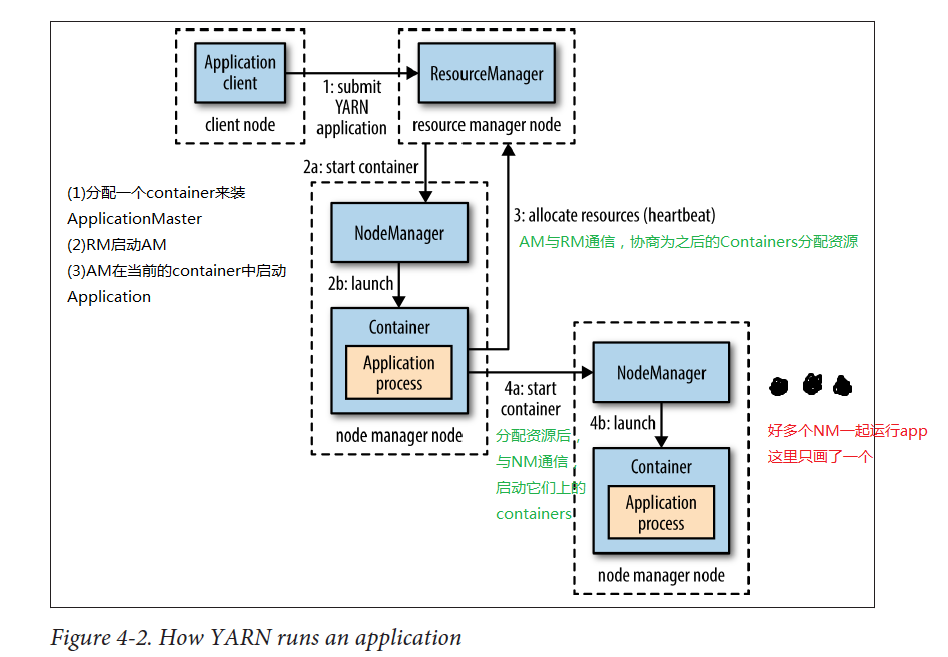

# Yarn

The fundamental idea of YARN is to split up the functionalities of `resource management` and `job scheduling/monitoring` into separate daemons. The idea is to have a global `ResourceManager` (RM) and per-application `ApplicationMaster` (AM). An application is either a single job or a DAG of jobs.

## Architecture
<div align="center"> 
    
</div>

## Components

**ResourceManager** 

The ResourceManager is the ultimate authority that arbitrates resources among all the applications in the system. The NodeManager is the per-machine framework agent who is responsible for containers, monitoring their resource usage (cpu, memory, disk, network) and reporting the same to the ResourceManager/Scheduler.

The ResourceManager has two main components:
- The `Scheduler` is responsible for allocating resources to the various running applications subject to familiar constraints of capacities, queues etc.The Scheduler is `pure scheduler` in the sense that it performs no monitoring or tracking of status for the application. Also, it offers no guarantees about restarting failed tasks either due to application failure or hardware failures. The Scheduler performs its scheduling function based on the resource requirements of the applications; it does so based on the abstract notion of a resource Container which incorporates elements such as memory, cpu, disk, network etc.
- The `ApplicationsManager` is responsible for accepting job-submissions, `negotiating the first container for executing the application` specific ApplicationMaster and provides the service for restarting the ApplicationMaster container on failure. The per-application ApplicationMaster has the responsibility of `negotiating` appropriate resource containers from the Scheduler, tracking their status and `monitoring` for progress.

**ApplicationMaster**

The per-application ApplicationMaster is, in effect, a framework specific library and is tasked with negotiating resources from the ResourceManager and working with the NodeManager(s) to execute and monitor the tasks.

## Command

usage: `yarn [--config confdir] COMMAND [--loglevel loglevel] [GENERIC_OPTIONS] [COMMAND_OPTIONS]`

**user command**

- Usage: `yarn application [options]`
- Usage: `yarn applicationattempt [options]`
- Usage: `yarn classpath [--glob |--jar <path> |-h |--help]`
- Usage: `yarn container [options]`
- Usage: `yarn jar <jar> [mainClass] args...`
- Usage: `yarn logs -applicationId <application ID> [options]`
- Usage: `yarn node [options]`
- Usage: `yarn queue [options]`
- Usage: `yarn envvars`
- Usage: `yarn version`
  
**Administration Commands**

- Usage: `yarn nodemanager`
- Usage: `yarn proxyserver`
- Usage: `yarn resourcemanager [-format-state-store]`
- Usage: `yarn rmadmin`
- Usage: `yarn schedulerconf [options]`
- Usage: `yarn scmadmin [options]`
- Usage: `yarn sharedcachemanager`
- Usage: `yarn timelineserver`


## Capacity Scheduler
> a pluggable scheduler for Hadoop which allows for multiple-tenants to securely share a large 
> cluster such that their applications are allocated resources in a timely manner under constraints 
> of allocated capacities.

**core idea**

The central idea is that the available resources in the Hadoop cluster are shared among multiple 
organizations who collectively fund the cluster based on their computing needs. There is an added 
benefit that an organization can access any excess capacity not being used by others. This provides 
elasticity for the organizations in a cost-effective manner.

**Features**

- `Hierarchical Queues` - Hierarchy of queues is supported to ensure resources are shared among the sub-queues of an organization before other queues are allowed to use free resources, thereby providing more control and predictability.
- `Capacity Guarantees` - Queues are allocated a fraction of the capacity of the grid in the sense that a certain capacity of resources will be at their disposal. All applications submitted to a queue will have access to the capacity allocated to the queue. Administrators can configure soft limits and optional hard limits on the capacity allocated to each queue.
- `Security` - Each queue has strict ACLs which controls which users can submit applications to individual queues. Also, there are safe-guards to ensure that users cannot view and/or modify applications from other users. Also, per-queue and system administrator roles are supported.
- `Elasticity` - Free resources can be allocated to any queue beyond its capacity. When there is demand for these resources from queues running below capacity at a future point in time, as tasks scheduled on these resources complete, they will be assigned to applications on queues running below the capacity (preemption is also supported). This ensures that resources are available in a predictable and elastic manner to queues, thus preventing artificial silos of resources in the cluster which helps utilization.
- `Multi-tenancy` - Comprehensive set of limits are provided to prevent a single application, user and queue from monopolizing resources of the queue or the cluster as a whole to ensure that the cluster isn’t overwhelmed.
- `Operability`
    - `Runtime Configuration` - The queue definitions and properties such as capacity, ACLs can be changed, at runtime, by administrators in a secure manner to minimize disruption to users. Also, a console is provided for users and administrators to view current allocation of resources to various queues in the system. Administrators can add additional queues at runtime, but queues cannot be deleted at runtime.
    - `Drain applications` - Administrators can stop queues at runtime to ensure that while existing applications run to completion, no new applications can be submitted. If a queue is in STOPPED state, new applications cannot be submitted to itself or any of its child queues. Existing applications continue to completion, thus the queue can be drained gracefully. Administrators can also start the stopped queues.
- `Resource-based Scheduling` - Support for resource-intensive applications, where-in a application can optionally specify higher resource-requirements than the default, thereby accommodating applications with differing resource requirements. Currently, memory is the resource requirement supported.
- `Queue Mapping based on User or Group` - This feature allows users to map a job to a specific queue based on the user or group.
- `Priority Scheduling` - This feature allows applications to be submitted and scheduled with different priorities. Higher integer value indicates higher priority for an application. Currently Application priority is supported only for FIFO ordering policy.

## Fair Scheduler

> a pluggable scheduler for Hadoop that allows YARN applications to share resources in large clusters fairly.
> Fair scheduling is a method of assigning resources to applications such that all apps get, on average, an equal share of resources over time.

**Introduce**

By default, the Fair Scheduler bases scheduling fairness decisions only on memory. It can be configured to schedule with both memory and CPU, 
using the notion of Dominant Resource Fairness.fair sharing can also work with app priorities - the priorities are used as weights to determine 
the fraction of total resources that each app should get.

## ResourceManager restart

it is potentially a single point of failure in a Apache YARN cluster. `ResourceManager Restart` is a feature that enhances ResourceManager to 
keep functioning across restarts and also makes ResourceManager down-time invisible to end-users.

ResourceManager Restart feature is divided into two phases:
- `ResourceManager Restart Phase 1` (Non-work-preserving RM restart): Enhance RM to persist application/attempt state and other credentials information in a pluggable state-store. RM will reload this information from state-store upon restart and re-kick the previously running applications. Users are not required to re-submit the applications. (As of Hadoop 2.4.0 release)
- `ResourceManager Restart Phase 2` (Work-preserving RM restart): Focus on re-constructing the running state of ResourceManager by combining the container statuses from NodeManagers and container requests from ApplicationMasters upon restart. `The key difference from phase 1 is that previously running applications will not be killed after RM restarts, and so applications won’t lose its work because of RM outage`.(As of Hadoop 2.6.0 release)

## ResourceManager High Availability

<div align="center">
    
</div>

**RM failover**

ResourceManager HA is realized through an Active/Standby architecture - at any point of time, one of the RMs is Active, and one or more RMs are in Standby mode 
waiting to take over should anything happen to the Active. The trigger to transition-to-active comes from either the admin (through CLI) or through the integrated 
failover-controller when automatic-failover is enabled.

**Recovering previous active-RM’s state**

there are two RMStateStore implementations for persistence - FileSystemRMStateStore and ZKRMStateStore. The ZKRMStateStore implicitly allows write access to 
a single RM at any point in time, and hence is the recommended store to use in an HA cluster. When using the ZKRMStateStore, there is no need for a separate 
fencing mechanism to address a potential split-brain situation where multiple RMs can potentially assume the Active role. When using the ZKRMStateStore, 
it is advisable to NOT set the “zookeeper.DigestAuthenticationProvider.superDigest” property on the Zookeeper cluster to ensure that the zookeeper admin does 
not have access to YARN application/user credential information.

**config**
```xml
<property>
  <name>yarn.resourcemanager.ha.enabled</name>
  <value>true</value>
</property>
<property>
  <name>yarn.resourcemanager.cluster-id</name>
  <value>cluster1</value>
</property>
<property>
  <name>yarn.resourcemanager.ha.rm-ids</name>
  <value>rm1,rm2</value>
</property>
<property>
  <name>yarn.resourcemanager.hostname.rm1</name>
  <value>master1</value>
</property>
<property>
  <name>yarn.resourcemanager.hostname.rm2</name>
  <value>master2</value>
</property>
<property>
  <name>yarn.resourcemanager.webapp.address.rm1</name>
  <value>master1:8088</value>
</property>
<property>
  <name>yarn.resourcemanager.webapp.address.rm2</name>
  <value>master2:8088</value>
</property>
<property>
  <name>yarn.resourcemanager.zk-address</name>
  <value>zk1:2181,zk2:2181,zk3:2181</value>
</property>
```

## Timeline Server

The Storage and retrieval of application’s current and historic information in a generic fashion is addressed in YARN through the Timeline Server. 
It has two responsibilities:

**Persisting Application Specific Information**

The collection and retrieval of information completely specific to an application or framework. For example, the Hadoop MapReduce framework can 
include pieces of information like number of map tasks, reduce tasks, counters…etc. Application developers can publish the specific information 
to the Timeline server via TimelineClient in the Application Master and/or the application’s containers.

This information is then queryable via REST APIs for rendering by application/framework specific UIs.

**Persisting Generic Information about Completed Applications**

Previously this was supported purely for MapReduce jobs by the Application History Server. With the introduction of the timeline server, 
the Application History Server becomes just one use of the Timeline Server.
Generic information includes application level data such as:
- queue-name,
- user information and the like set in the ApplicationSubmissionContext,
- a list of application-attempts that ran for an application
- information about each application-attempt
- the list of containers run under each application-attempt
- information about each container.

Generic data is published by the YARN Resource Manager to the timeline store and used by its web-UI to display information about completed applications.

## Yarn Flow

After `YarnClient` is started, the client can then set up application context, prepare the very `first container` of the application that contains the 
`ApplicationMaster` (AM), and then submit the application. The YARN ResourceManager will then launch the ApplicationMaster (as specified) on an allocated container. 
The ApplicationMaster `communicates` with YARN cluster, and `handles application execution`. It performs operations in `an asynchronous fashion`. 
During application launch time, the main tasks of the ApplicationMaster are: 

a) communicating with the ResourceManager to negotiate and allocate resources for future containers, and 
b) after container allocation, communicating YARN *NodeManager*s (NMs) to launch application containers on them. 

Task a) can be performed asynchronously through an AMRMClientAsync object, with event handling methods specified in a AMRMClientAsync.CallbackHandler type of event 
handler. The event handler needs to be set to the client explicitly. 
Task b) can be performed by launching a runnable object that then launches containers when there are containers allocated. 

As part of launching this container, the AM has to specify the ContainerLaunchContext that has the launch information such as command line specification, 
environment, etc.

<div align="center">
    
</div>

## NodeManager

> The NodeManager is responsible for launching and managing containers on a node. Containers execute tasks as specified by the AppMaster.

**Health Checker Service**

The NodeManager runs services to determine the health of the node it is executing on. The services perform checks on the `disk` as well as 
`any user specified tests`. If any health check fails, the NodeManager marks the node as unhealthy and communicates this to the ResourceManager, 
which then stops assigning containers to the node. Communication of the node status is done as part of the heartbeat between the NodeManager and 
the ResourceManager. The intervals at which the disk checker and health monitor(described below) run don’t affect the heartbeat intervals. 
When the heartbeat takes place, the status of both checks is used to determine the health of the node.

**NodeManager Restart**

This document gives an overview of NodeManager (NM) restart, a feature that enables the NodeManager to be restarted without losing the active 
containers running on the node. At a high level, the NM stores any necessary state to a local state-store as it processes container-management 
requests. When the NM restarts, it recovers by first loading state for various subsystems and then letting those subsystems perform recovery 
using the loaded state.

##  ReservationSystem

> The ReservationSystem of YARN provides the user the ability to reserve resources over (and ahead of) time, to ensure that important production 
> jobs will be run very predictably. The ReservationSystem performs careful admission control and provides guarantees over absolute amounts of 
> resources (instead of % of cluster size). Reservation can be both malleable or have gang semantics, and can have time-varying resource requirements. 
> The ReservationSystem is a component of the YARN ResourceManager.

<div align="center">
    
</div>

With reference to the figure above, a typical reservation proceeds as follows:

- `Step 0` The user (or an automated tool on its behalf) submits a reservation creation request, and receives a response containing the ReservationId.
- `Step 1` The user (or an automated tool on its behalf) submits a reservation request specified by the Reservation Definition Language (RDL) and ReservationId retrieved from the previous step. This describes the user need for resources over-time (e.g., a skyline of resources) and temporal constraints (e.g., deadline). This can be done both programmatically through the usual Client-to-RM protocols or via the REST api of the RM. If a reservation is submitted with the same ReservationId, and the RDL is the same, a new reservation will not be created and the request will be successful. If the RDL is different, the reservation will be rejected, and the request will be unsuccessful.
- `Step 2` The ReservationSystem leverages a ReservationAgent (GREE in the figure) to find a plausible allocation for the reservation in the Plan, a data structure tracking all reservation currently accepted and the available resources in the system.
- `Step 3` The SharingPolicy provides a way to enforce invariants on the reservation being accepted, potentially rejecting reservations. For example, the CapacityOvertimePolicy allows enforcement of both instantaneous max-capacity a user can request across all of his/her reservations and a limit on the integral of resources over a period of time, e.g., the user can reserve up to 50% of the cluster capacity instantanesouly, but in any 24h period of time he/she cannot exceed 10% average.
- `Step 4` Upon a successful validation the ReservationSystem returns to the user a ReservationId (think of it as an airline ticket).
- `Step 5` When the time comes, a new component called the PlanFollower publishes the state of the plan to the scheduler, by dynamically creating/tweaking/destroying queues.
- `Step 6` The user can then submit one (or more) jobs to the reservable queue, by simply including the ReservationId as part of the ApplicationSubmissionContext.
- `Step 7` The Scheduler will then provide containers from a special queue created to ensure resources reservation is respected. Within the limits of the reservation, the user has guaranteed access to the resources, above that resource sharing proceed with standard Capacity/Fairness sharing.
- `Step 8` The system includes mechanisms to adapt to drop in cluster capacity. This consists in replanning by “moving” the reservation if possible, or rejecting the smallest amount of previously accepted reservation (to ensure that other reservation will receive their full amount).
