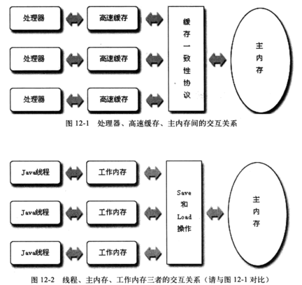
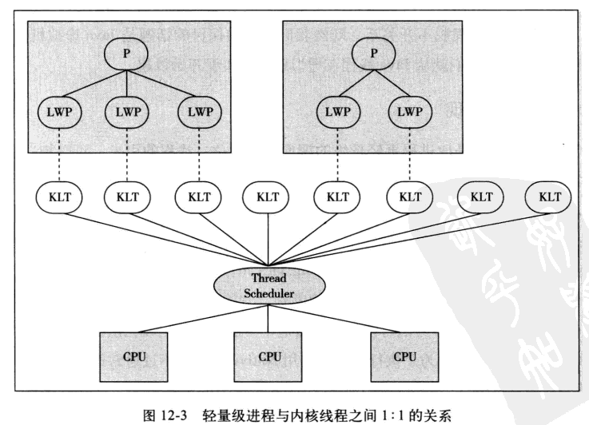
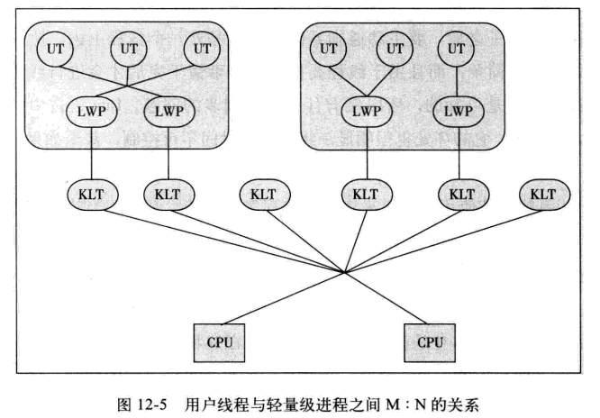

## 重要的意识
无论何时，只要有多于一个的线程访问给定的状态变量，而且其中某个线程会写入该变量，此时必须使用同步来协调线程对该变量的访问。Java 中首要的同步机制是 `synchronized` 关键字，它提供了独占锁。除此之外，术语“同步”还包括`volatile`变量，显示锁和原子变量的使用。

## Java 内存模型

**主内存与工作内存**

java 内存模型的主要目标是定义程序中各个变量的访问规则，即在虚拟机中将变量存储到内存和从内存中取出变量这样的底层细节。此处变量与java编程中所说的略有不同。

java 内存模型规定了所有的变量存储在主内存中，每条线程还有自己的工作内存，线程的工作内存中保存了被该线程使用到的变量的主内存副本拷贝，线程对变量的所有操作都必须在工作内存中进行，而不能直接读写主内存中额变量。

<div align="center">
    
</div>

- 内存模型的8种操作: lock unlock read load use assign store write
- java内存操作三种特性：原子性、可见性、有序性

## java 线程

**线程的实现**

线程的实现（不仅是java）主要有三种方式：使用内核实现、使用用户线程实现、使用用户进程加轻量级进程混合实现。

`内核线程`

内核线程（Kernel Thread，KLT）就是直接由操作系统内核支持的线程，这种线程由内核来完成线程切换，内核通过操纵调度器（Scheduler）对线程进行调度，并负责将线程的任务映射到各个处理器上，支持多线程的内核叫多线程内核。

`轻量级进程`

程序一般不会直接使用内核线程，而是使用内核线程的高级接口，轻量级进程（Light Weight Process, LWP)，轻量级进程就是通常意义上所讲的线程，轻量级进程与内核线程之间1：1的关系称作一对一的线程模型，如下图：

<div align="center">
    
</div>

局限：
1. 基于内核线程实现，所以各种进程操作都需要进行系统调用，需要在用户态和内核态之间来回切换，代价较高。
2. 支持轻量级进程会消耗一定的内核资源（如内核栈空间），因此一个系统支持的轻量级进程的数量有限。

`用户线程`

广义上来说，除了内核线程之外的，都是用户线程（User Thread, UT)，包括轻量级进程。

狭义上的用户线程指的是完全建立在用户空间的线程库上，系统内核不能感知线程的存在。用户线程的所有操作不需要在
用户态、内核态切换，操作可以十分消耗快速。但是线程的管理没有内核的支援，都需要用户自己管理，因此比较复杂，所以现在使用比较少。

`混合实现`

内核线程与用户线程一起使用的实现方式，既存在用户线程，也存在轻量级进程。用户线程还是完全建立在用户空间，操作依然廉价，并且支持大规模的用户线程并发。而操作系统提供支持的轻量级进程作为用户线程和内核线程之间的桥梁，通过内核来管理线程。在这种混合模式中，用户线程与轻量级进程的数量比是 M : N 的关系，如下图：

<div align="center">
    
</div>

### java 线程调度

线程调度是指系统为线程分配处理器使用权的过程，主要调度方式有两种，分别是`协同式线程调度`（Cooperative Threads-Scheduling）和`抢占式线程调度`（Preemptive Threads-Scheduling）。

使用协同式调度的多线程系统，线程的执行时间由线程本身来控制，线程把自己的工作执行完了之后，要主动通知系统切换到另外一个线程上。好处：实现简单，坏处：线程执行时间不可控制。

抢占式调度的多线程系统，那么每个线程将由系统来分配执行时间，线程的切换不由线程本身来决定（在Java中，`Thread.yield()`可以让出执行时间，但是要获取执行时间的话，线程本身是没有什么办法的）。在这种实现线程调度的方式下，线程的执行时间是系统可控的，也不会有一个线程导致整个进程阻塞的问题，Java使用的线程调度方式就是抢占式调度。

**线程状态转换**

Java语言定义了5种线程状态，在任意一个时间点，一个线程只能有且只有其中的一种状态，这5种状态分别如下：

- `新建（New）：`创建后尚未启动的线程处于这种状态。

- `运行（Runable）`：Runable包括了操作系统线程状态中的Running和Ready，也就是处于此状态的线程有可能正在执行，也有可能正在等待着CPU为它分配执行时间。

- `无限期等待（Waiting）`：处于这种状态的线程不会被分配CPU执行时间，它们要等待被其他线程显式地唤醒。以下方法会让线程陷入无限期的等待状态：
    - 没有设置Timeout参数的Object.wait()方法。
    - 没有设置Timeout参数的Thread.join()方法。
    - LockSupport.park()方法。
  
- `限期等待（Timed Waiting）`：处于这种状态的线程也不会被分配CPU执行时间，不过无须等待被其他线程显式地唤醒，在一定时间之后它们会由系统自动唤醒。以下方法会让线程进入限期等待状态：
  - Thread.sleep()方法。
  - 设置了Timeout参数的Object.wait()方法。
  - 设置了Timeout参数的Thread.join()方法。
  - LockSupport.parkNanos()方法。
  - LockSupport.parkUntil()方法

- `阻塞（Blocked）`：线程被阻塞了，“阻塞状态”与“等待状态”的区别是：“阻塞状态”在等待着获取到一个排他锁，这个事件将在另外一个线程放弃这个锁的时候发生；而“等待状态”则是在等待一段时间，或者唤醒动作的发生。在程序等待进入同步区域的时候，线程将进入这种状态。

- `结束（Terminated）`：已终止线程的线程状态，线程已经结束执行。

<div align="center">
    
</div>

**线程安全**

线程安全定义：当多个线程访问一个对象时，如果不用考虑这些线程在运行时环境下的调度和交替执行，也不需要进行额外的同步，或者在调用方进行任何其他的协调操作，调用这个对象的行为都可以获得正确的结果，那这个对象是线程安全的。

将Java语言中各种操作共享的数据分为以下5类：
- 不可变：绝对线程安全；
  
- 绝对线程安全: 不管运行时环境如何，调用者都不需要任何额外的同步措施,很难达到。

- 相对线程安全：通常意义上所讲的线程安全，它需要保证对这个对象单独的操作是线程安全的，我们在调用的时候不需要做额外的保障措施，但是对于一些特定顺序的连续调用，就可能需要在调用端使用额外的同步手段来保证调用的正确性。

- 线程兼容：线程兼容是指对象本身并不是线程安全的，但是可以通过在调用端正确地使用同步手段来保证对象在并发环境中可以安全地使用，我们平常说一个类不是线程安全的，绝大多数时候指的是这一种情况。

- 线程对立：线程对立是指无论调用端是否采取了同步措施，都无法在多线程环境中并发使用的代码。

## 线程安全实现方法

**互斥同步(阻塞同步)**

在Java中，最基本的互斥同步手段就是synchronized关键字，synchronized关键字经过编译之后，会在同步块的前后分别形成`monitorenter`和`monitorexit`这两个字节码指令，这两个字节码都需要一个reference类型的参数来指明要锁定和解锁的对象。如果Java程序中的synchronized明确指定了对象参数，那就是这个对象的reference；如果没有明确指定，那就根据synchronized修饰的是实例方法还是类方法，去取对应的对象实例或Class对象来作为锁对象。

在执行monitorenter指令时，首先要尝试获取对象的锁。如果这个对象没被锁定，或者当前线程已经拥有了那个对象的锁，把锁的计数器加1，相应的，在执行monitorexit指令时会将锁计数器减1，当计数器为0时，锁就被释放。如果获取对象锁失败，那当前线程就要阻塞等待，直到对象锁被另外一个线程释放为止。

Java的线程是映射到操作系统的原生线程之上的，如果要阻塞或唤醒一个线程，都需要操作系统来帮忙完成，这就需要从用户态转换到核心态中，因此状态转换需要耗费很多的处理器时间。对于代码简单的同步块（如被synchronized修饰的getter()或setter()方法），状态转换消耗的时间有可能比用户代码执行的时间还要长。所以synchronized是Java语言中一个重量级（Heavyweight）的操作，有经验的程序员都会在确实必要的情况下才使用这种操作。

**非阻塞同步**

从处理问题的方式上说，互斥同步属于一种悲观的并发策略，总是认为只要不去做正确的同步措施（例如加锁），那就肯定会出现问题，无论共享数据是否真的会出现竞争，它都要进行加锁（这里讨论的是概念模型，实际上虚拟机会优化掉很大一部分不必要的加锁）、用户态核心态转换、维护锁计数器和检查是否有被阻塞的线程需要唤醒等操作。随着硬件指令集的发展，我们有了另外一个选择：`基于冲突检测的乐观并发策略，通俗地说，就是先进行操作，如果没有其他线程争用共享数据，那操作就成功了；如果共享数据有争用，产生了冲突，那就再采取其他的补偿措施`（最常见的补偿措施就是不断地重试，直到成功为止），这种乐观的并发策略的许多实现都不需要把线程挂起，因此这种同步操作称为非阻塞同步（Non-Blocking Synchronization）。

尽管CAS看起来很美，但显然这种操作无法涵盖互斥同步的所有使用场景，并且CAS从语义上来说并不是完美的，存在这样的一个逻辑漏洞：如果一个变量V初次读取的时候是A值，并且在准备赋值的时候检查到它仍然为A值，那我们就能说它的值没有被其他线程改变过了吗？如果在这段期间它的值曾经被改成了B，后来又被改回为A，那CAS操作就会误认为它从来没有被改变过。这个漏洞称为CAS操作的`"ABA"`问题。

## 锁优化

**自旋锁与自适应自旋**

互斥同步对性能最大的影响是阻塞的实现，挂起线程和恢复线程的操作都需要转入内核态中完成，这些操作给系统的并发性能带来了很大的压力。同时在许多应用上，共享数据的锁定状态只会持续很短的一段时间，为了这段时间去挂起和恢复线程并不值得。如果物理机器有一个以上的处理器，能让两个或以上的线程同时并行执行，我们就可以让后面请求锁的那个线程“稍等一下”，但不放弃处理器的执行时间，看看持有锁的线程是否很快就会释放锁。为了让线程等待，我们只需让线程执行一个忙循环（自旋），这项技术就是所谓的`自旋锁`。如果锁被占用的时间很短，自旋等待的效果就会非常好，反之，如果锁被占用的时间很长，那么自旋的线程只会白白消耗处理器资源，而不会做任何有用的工作，反而会带来性能上的浪费。自旋等待的时间必须要有一定的限度，如果自旋超过了限定的次数仍然没有成功获得锁，就应当使用传统的方式去挂起线程了。自旋次数的默认值是10次，用户可以使用参数-XX:PreBlockSpin来更改。`自适应意味着自旋的时间不再固定了，而是由前一次在同一个锁上的自旋时间及锁的拥有者的状态来决定。`

**锁消除**

锁消除是指虚拟机即时编译器在运行时，对一些代码上要求同步，但是被检测到不可能存在共享数据竞争的锁进行消除。

变量是否逃逸，对于虚拟机来说需要使用数据流分析来确定，但是程序员自己应该是很清楚的，怎么会在明知道不存在数据争用的情况下要求同步呢？答案是有许多同步措施并不是程序员自己加入的。如下例：
```java
// 程序员写的代码
public String concatString（String s1，String s2，String s3）{
    return s1+s2+s3；
}

// 编译器转化后的代码
public String concatString（String s1，String s2，String s3）{
    StringBuffer sb=new StringBuffer()；
    sb.append（s1）；
    sb.append（s2）；
    sb.append（s3）；
    return sb.toString()；
}
```

**锁粗化**

原则上，我们在编写代码的时候，总是推荐将同步块的作用范围限制得尽量小——只在共享数据的实际作用域中才进行同步，这样是为了使得需要同步的操作数量尽可能变小，如果存在锁竞争，那等待锁的线程也能尽快拿到锁。

大部分情况下，上面的原则都是正确的，但是如果一系列的连续操作都对同一个对象反复加锁和解锁，甚至加锁操作是出现在循环体中的，那即使没有线程竞争，频繁地进行互斥同步操作也会导致不必要的性能损耗。

代码清单13-7中连续的append()方法就属于这类情况。如果虚拟机探测到有这样一串零碎的操作都对同一个对象加锁，将会把加锁同步的范围扩展（粗化）到整个操作序列的外部，以代码清单13-7为例，就是扩展到第一个append()操作之前直至最后一个append()操作之后，这样只需要加锁一次就可以了。

