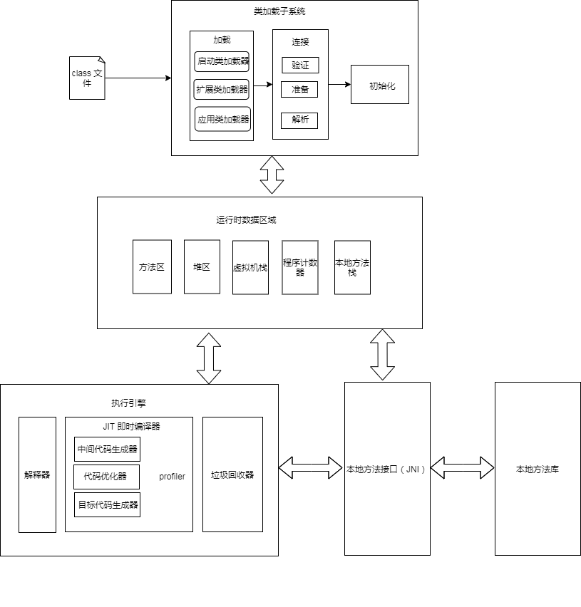

## jvm 是什么？

JVM是Java Virtual Machine（Java虚拟机）的缩写，JVM是一种用于计算设备的规范，它是一个虚构出来的计算机，是通过在实际的计算机上仿真模拟各种计算机功能来实现的。引入Java语言虚拟机后，Java语言在不同平台上运行时不需要重新编译。Java语言使用Java虚拟机屏蔽了与具体平台相关的信息，使得Java语言编译程序只需生成在Java虚拟机上运行的目标代码（字节码），就可以在多种平台上不加修改地运行。实现 JVM 规范的虚拟机有很多，常用的是 HotSpot JVM。

## JVM 架构

    

**jvm 运行流程**

1. 将 .java 文件编译为 .class 文件；
2. 类加载子系统加载 .class 文件，转换为 java 类，并将运行数据加载到 JVM 运行数据区域中；
3. 由执行引擎对运行时数据进行解释编码，即时编译生成目标代码；
4. 调用本地方法接口执行目标代码；

## jvm 核心模块

### java 文件

- *.java 文件
- *.class 文件

.java 文件是符合 java 语言语法的文件主要的识别对象是程序员，方面程序员的编写与理解；.class 文件是符合 jvm 规范的的文件，主要的识别对象是 java 虚拟机，方便不同平台的 java 虚拟机将其转换为对应的机器码。class 文件是由 java 文件通过各种编译器编译得到，而 class 文件转换成不同的机器代码则由 jvm 内部的即时编译器编译（JIT）得到。

### 类加载子系统

虚拟机把描述类的数据从Class文件加载到内存，并对数据进行校验、转换解析和初始化，最终形成可以被虚拟机直接使用的Java类型，这就是虚拟机的类加载机制。

`在Java语言里面，类型的加载、连接和初始化过程都是在程序运行期间完成的，这种策略虽然会令类加载时稍微增加一些性能开销，但是会为Java应用程序提供高度的灵活性，Java里天生可以动态扩展的语言特性就是依赖运行期动态加载和动态连接这个特点实现的。`

### java 内存管理

运行时数据区域：根据数据的用途不同将数据划分为5个区域，包括：

- 堆
- 方法区
- 虚拟机栈
- 本地方法栈
- 程序计数器

java 内存模型：

- 主要目标是定义程序中各个变量的访问规则，即在虚拟机中将变量存储到内存和从内存中取出变量这样的底层细节；
- 主要解决的问题是多线程之间访问数据的竞争导致的数据一致性问题；

运行时数据区域与java内存模型的区别：  

这两者不是同一个层次的内存划分，这两者基本上是`没有关系的`，如果两者一定要勉强对应起来，那从变量、主内存、工作内存的定义来看，主内存主要对应于Java堆中的对象实例数据部分，而工作内存则对应于虚拟机栈中的部分区域。从更低层次上说，主内存就直接对应于物理硬件的内存，而为了获取更好的运行速度，虚拟机（甚至是硬件系统本身的优化措施）可能会让工作内存优先存储于寄存器和高速缓存中，因为程序运行时主要访问读写的是工作内存。

### java 执行引擎

执行 jvm 规范定义的字节码,执行方式包括`解释执行`与`编译执行`，执行引擎根据线程当前线程的栈帧找到对应的字节码，执行字节码并返回结果。