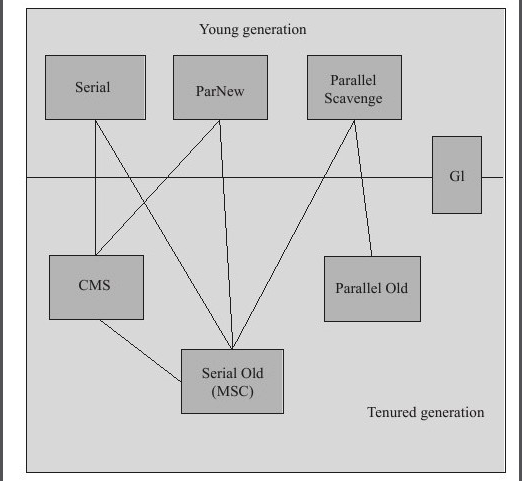
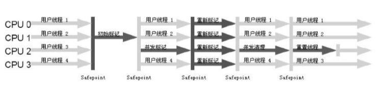
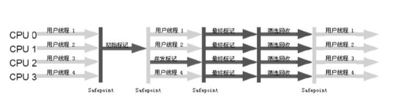

## jvm 运行时数据区域

<div align="center">
    
</div>

**线程共享区域**

堆：Java堆（JavaHeap）是Java虚拟机所管理的内存中最大的一块。Java堆是被所有线程共享的一块内存区域，在虚拟机启动时创建。此内存区域的唯一目的就是`存放对象实例与数组`，几乎所有的对象实例都在这里分配内存。`Java堆是垃圾收集器管理的主要区域`，因此很多时候也被称做“GC堆”。从内存回收的角度来看，由于现在收集器基本都采用分代收集算法，所以Java堆中还可以细分为：新生代和老年代；再细致一点的有Eden空间、From Survivor空间、ToSurvivor空间，比例为 8 ：1 ：1 。

方法区（MethodArea）: 与Java堆一样，是各个线程共享的内存区域，它`用于存储已被虚拟机加载的类信息、常量、静态变量、即时编译器编译后的代码等数据`。虽然Java虚拟机规范把方法区描述为堆的一个逻辑部分，但是它却有一个别名叫做Non-Heap（非堆），目的应该是与Java堆区分开来。运行时常量池（Runtime ConstantPool）是方法区的一部分。Class文件中除了有类的版本、字段、方法、接口等描述信息外，还有一项信息是常量池（Constant PoolTable），`用于存放编译期生成的各种字面量和符号引用，这部分内容将在类加载后进入方法区的运行时常量池中存放。`


**线程私有区域**

程序计数器（Program CounterRegister）: 是一块较小的内存空间，它可以看作是当前线程所执行的字节码的行号指示器。在虚拟机的概念模型里（仅是概念模型，各种虚拟机可能会通过一些更高效的方式去实现），字节码解释器工作时就是通过改变这个计数器的值来选取下一条需要执行的字节码指令，分支、循环、跳转、异常处理、线程恢复等基础功能都需要依赖这个计数器来完成。如果正在执行的是Native方法，这个计数器值则为空（Undefined）。

Java虚拟机栈（Java Virtual MachineStacks）:也是线程私有的，它的生命周期与线程相同。虚拟机栈描述的是Java方法执行的内存模型：`每个方法在执行的同时都会创建一个栈帧（Stack Frame）用于存储局部变量表、操作数栈、动态链接、方法出口等信息。每一个方法从调用直至执行完成的过程，就对应着一个栈帧在虚拟机栈中入栈到出栈的过程。`

本地方法栈（Native MethodStack）: 与虚拟机栈所发挥的作用是非常相似的，它们之间的区别不过是虚拟机栈为虚拟机执行Java方法（也就是字节码）服务，而本地方法栈则为虚拟机使用到的Native方法服务。


## 垃圾回收

垃圾回收发生的区域： java 堆；

垃圾回收做哪些事情？

1. 哪些内存需要回收？
2. 什么时候回收？
3. 如何回收？

### 哪些内存需要回收？

对已经“死去”的对象进行回收，即这些对象已不在被引用，如何判断对象是否被引用有两种方式：

- 引用计数法
- 可达性分析算法


**引用计数算法**

给对象中添加一个引用计数器，每当有一个地方引用它时，计数器值就加1；当引用失效时，计数器值就减1；任何时刻计数器为0的对象就是不可能再被使用的。

缺点：主流的Java虚拟机里面没有选用引用计数算法来管理内存，其中最主要的原因是它很难解决对象之间相互循环引用的问题。

**可达性分析算法**

通过一系列的称为“GCRoots”的对象作为起始点，从这些节点开始向下搜索，搜索所走过的路径称为引用链（Reference Chain），当一个对象到GCRoots没有任何引用链相连（用图论的话来说，就是从GCRoots到这个对象不可达）时，则证明此对象是不可用的。

在Java语言中，可作为GC Roots的对象包括下面几种：

- 虚拟机栈（栈帧中的本地变量表）中引用的对象。
- 方法区中类静态属性引用的对象。
- 方法区中常量引用的对象。
- 本地方法栈中JNI（即一般说的Native方法）引用的对象。

### 什么时候需要回收？

概括来说，当进行内存分配时，产生了内存空间的连续片段不够用时，需要进行回收，具体的回收发生时刻如下：

- 对象优先分配在Eden区，若Eden区没有足够的空间，虚拟机发生一次Minor GC。
  
- 大对象直接进入老年代，若老年代没有足够的连续区域，虚拟机发生一次Full GC。

- 在发生Minor GC时，虚拟机会检测每次晋升到老年代的平均大小是否大于老年代的剩余大小，如果大于则直接进行一次Full GC，如果小于，则查看HandlePromotionFailure是否允许担保失败，如果允许则进行Minor GC，如果不允许则直接进入Full GC。当复制算法中survivor区域无法容纳存活对象时，需要老年代进行担保，将存活对象直接进入老年代。

Minor GC：指发生在新生代区域的垃圾回收，因为java对象具备朝生夕灭的特性，所以Minor GC发生比较频繁，一般回收速度也比较快。

Full GC：发生在老年代的GC，经常伴随至少1次的Minor GC，Full GC的速度一般比Minor GC慢10倍以上。


### 如何进行回收？

**标记-清除算法**  

首先标记所有待回收的对象，标记完成后统一回收；

要真正宣告一个对象死亡，至少要`经历两次标记过程`：如果对象在进行可达性分析后发现没有与GC Roots相连接的引用链，那它将会被第一次标记并且进行一次筛选，筛选的条件是此对象是否有必要执行`finalize()`方法。当对象没有覆盖finalize()方法，或者finalize()方法已经被虚拟机调用过，虚拟机将这两种情况都视为“没有必要执行”。如果这个对象被判定为有必要执行finalize()方法，那么这个对象将会放置在一个叫做`F-Queue`的队列之中，并在稍后由一个由虚拟机自动建立的、低优先级的Finalizer线程去执行它。这里所谓的“执行”是指虚拟机会触发这个方法，但并不承诺会等待它运行结束，这样做的原因是，如果一个对象在finalize()方法中执行缓慢，或者发生了死循环（更极端的情况），将很可能会导致F-Queue队列中其他对象永久处于等待，甚至导致整个内存回收系统崩溃，finalize()方法是对象逃脱死亡命运的最后一次机会，稍后GC将对F-Queue中的对象进行第二次小规模的标记，如果对象要在finalize()中成功拯救自己——只要重新与引用链上的任何一个对象建立关联即可，譬如把自己（this关键字）赋值给某个类变量或者对象的成员变量，那在第二次标记时它将被移除出“即将回收”的集合；如果对象这时候还没有逃脱，那基本上它就真的被回收了。

缺点：

一是效率问题，标记和清除效率都不高；  
二是空间问题，标记清除后会产生大量的不连续内存碎片。空间碎片太多可能会导致以后在程序运行过程中需要分配较大对象时，无法找到足够的连续内存而不得不提前触发另一次垃圾收集动作。


**复制算法**

将内存划分成容量相等的两块，每次使用其中一块，当这块用完了就将存活的对象复制到另一块上，再把使用的一块一次清理掉。

- 优点：高效 
- 缺点：浪费内存

新生代中的对象98%是“朝生夕死”的，所以并不需要按照1:1的比例来划分内存空间，而是将内存分为一块较大的Eden空间和两块较小的Survivor空间，每次使用Eden和其中一块Survivor。当回收时，将Eden和Survivor中还存活着的对象一次性地复制到另外一块Survivor空间上，最后清理掉Eden和刚才用过的Survivor空间。HotSpot虚拟机默认Eden和Survivor的大小比例是8:1，也就是每次新生代中可用内存空间为整个新生代容量的90%（80%+10%），只有10%的内存会被“浪费”。当然，98%的对象可回收只是一般场景下的数据，我们没有办法保证每次回收都只有不多于10%的对象存活，当Survivor空间不够用时，需要依赖其他内存（这里指老年代）进行分配担保（Handle Promotion）。如果另外一块Survivor空间没有足够空间存放上一次新生代收集下来的存活对象时，这些对象将直接通过分配担保机制进入老年代。

**标记-整理算法**

复制收集算法在对象存活率较高时就要进行较多的复制操作，效率将会变低。更关键的是，如果不想浪费50%的空间，就需要有额外的空间进行分配担保，以应对被使用的内存中所有对象都100%存活的极端情况，所以在老年代一般不能直接选用这种算法。

根据老年代的特点，有人提出了另外一种“标记-整理”（Mark-Compact）算法，标记过程仍然与“标记-清除”算法一样，但后续步骤不是直接对可回收对象进行清理，而是让所有存活的对象都向一端移动，然后直接清理掉端边界以外的内存。

**分代收集算法**

当前商业虚拟机的垃圾收集都采用“分代收集”（Generational Collection）算法，这种算法并没有什么新的思想，只是根据对象存活周期的不同将内存划分为几块。一般是把Java堆分为新生代和老年代，这样就可以根据各个年代的特点采用最适当的收集算法。在`新生代`中，每次垃圾收集时都发现有大批对象死去，只有少量存活，那就选用`复制算法`，只需要付出少量存活对象的复制成本就可以完成收集。而`老年代`中因为对象存活率高、没有额外空间对它进行分配担保，就必须使用`“标记—清理”或者“标记—整理”算法来进行回收。`


## 垃圾收集器

Java 虚拟中通常包含多个不同的垃圾收集器以满足不同场景的垃圾回收，HotSpot 虚拟机的垃圾收集器如下图所示：

<div align="center"> 
    
</div>

上图展示了7种作用于不同分代的收集器，如果两个收集器之间存在连线，就说明它们可以搭配使用。虚拟机所处的区域，则表示它是属于新生代收集器还是老年代收集器。

### CMS 收集器

`CMS（Concurrent MarkSweep）收集器是一种以获取最短回收停顿时间为目标的收集器`。目前很大一部分的Java应用集中在互联网站或者B/S系统的服务端上，这类应用尤其重视服务的响应速度，希望系统停顿时间最短，以给用户带来较好的体验。CMS收集器就非常符合这类应用的需求。

CMS收集器是基于“标记—清除”算法实现的，整个过程分为4个步骤:

1. 初始标记（CMS initial mark）
2. 并发标记（CMS concurrent mark）
3. 重新标记（CMS remark）
4. 并发清除（CMS concurrent sweep）

<div align="center"> 
    
</div>

初始标记、重新标记这两个步骤仍然需要“Stop TheWorld”。`初始标记`仅仅只是标记一下GCRoots能直接关联到的对象，速度很快，`并发标记`阶段就是进行GCRootsTracing的过程，而`重新标记`阶段则是为了修正并发标记期间因用户程序继续运作而导致标记产生变动的那一部分对象的标记记录，这个阶段的停顿时间一般会比初始标记阶段稍长一些，但远比并发标记的时间短。
由于整个过程中耗时最长的并发标记和`并发清除`过程收集器线程都可以与用户线程一起工作，所以，从总体上来说，CMS收集器的内存回收过程是与用户线程一起并发执行的。

但是CMS还远达不到完美的程度，它有以下3个明显的缺点：
1. CMS收集器对CPU资源非常敏感。因为占用了一部分线程（或者说CPU资源）而导致应用程序变慢，总吞吐量会降低。

2. CMS收集器无法处理浮动垃圾（Floating Garbage），可能出现“Concurrent ModeFailure”失败而导致另一次FullGC的产生。如果在应用中老年代增长不是太快，可以适当调高参数`-XX：CMSInitiatingOccupancyFraction`的值来提高触发百分比，以便降低内存回收次数从而获取更好的性能，但是太高反而降低性能。

3. CMS是一款基于“标记—清除”算法实现的收集器，这意味着收集结束时会有大量空间碎片产生。空间碎片过多时，将会给大对象分配带来很大麻烦，往往会出现老年代还有很大空间剩余，但是无法找到足够大的连续空间来分配当前对象，不得不提前触发一次FullGC。CMS收集器提供了一个`-XX：+UseCMSCompactAtFullCollection`开关参数（默认就是开启的），用于在CMS收集器顶不住要进行FullGC时开启内存碎片的合并整理过程，内存整理的过程是无法并发的，空间碎片问题没有了，但停顿时间不得不变长。虚拟机设计者还提供了另外一个参数`-XX：CMSFullGCsBeforeCompaction`，这个参数是用于设置执行多少次不压缩的FullGC后，跟着来一次带压缩的（默认值为0，表示每次进入Full GC时都进行碎片整理）。


### G1 收集器

G1（Garbage-First）收集器的特点：

- 并行与并发：G1能充分利用多CPU、多核环境下的硬件优势，使用多个CPU（CPU或者CPU核心）来缩短Stop-The-World停顿的时间，部分其他收集器原本需要停顿Java线程执行的GC动作，G1收集器仍然可以通过并发的方式让Java程序继续执行。

- 分代收集

- 空间整合：与CMS的“标记—清理”算法不同，G1从整体来看是基于“标记—整理”算法实现的收集器，从局部（两个Region之间）上来看是基于“复制”算法实现的，但无论如何，这两种算法都意味着G1运作期间不会产生内存空间碎片，收集后能提供规整的可用内存。

- 可预测的停顿：G1除了追求低停顿外，还能建立可预测的停顿时间模型，能让使用者明确指定在一个长度为M毫秒的时间片段内，消耗在垃圾收集上的时间不得超过N毫秒。

在G1之前的其他收集器进行收集的范围都是整个新生代或者老年代，而G1不再是这样。使用G1收集器时，Java堆的内存布局就与其他收集器有很大差别，它将整个Java堆划分为多个大小相等的独立区域（Region），虽然还保留有新生代和老年代的概念，但新生代和老年代不再是物理隔离的了，它们都是一部分Region（不需要连续）的集合。

G1收集器之所以能建立可预测的停顿时间模型，是因为它可以有计划地避免在整个Java堆中进行全区域的垃圾收集。G1跟踪各个Region里面的垃圾堆积的价值大小（回收所获得的空间大小以及回收所需时间的经验值），在后台维护一个优先列表，每次根据允许的收集时间，优先回收价值最大的Region（这也就是Garbage-First名称的来由）。这种使用Region划分内存空间以及有优先级的区域回收方式，保证了G1收集器在有限的时间内可以获取尽可能高的收集效率。

如果不计算维护RememberedSet的操作，G1收集器的运作大致可划分为以下几个步骤：

1. 初始标记（Initial Marking）
2. 并发标记（Concurrent Marking）
3. 最终标记（Final Marking）
4. 筛选回收（Live Data Counting and Evacuation）

<div align="center"> 
    
</div>

初始标记阶段仅仅只是标记一下GCRoots能直接关联到的对象，并且修改TAMS（Next Top at MarkStart）的值，让下一阶段用户程序并发运行时，能在正确可用的Region中创建新对象，这阶段需要停顿线程，但耗时很短。并发标记阶段是从GCRoot开始对堆中对象进行可达性分析，找出存活的对象，这阶段耗时较长，但可与用户程序并发执行。而最终标记阶段则是为了修正在并发标记期间因用户程序继续运作而导致标记产生变动的那一部分标记记录，虚拟机将这段时间对象变化记录在线程Remembered Set Logs里面，最终标记阶段需要把Remembered SetLogs的数据合并到RememberedSet中，这阶段需要停顿线程，但是可并行执行。最后在筛选回收阶段首先对各个Region的回收价值和成本进行排序，根据用户所期望的GC停顿时间来制定回收计划，从Sun公司透露出来的信息来看，这个阶段其实也可以做到与用户程序一起并发执行，但是因为只回收一部分Region，时间是用户可控制的，而且停顿用户线程将大幅提高收集效率。

CMS 与 G1 的对比：https://www.cnblogs.com/heyonggang/p/11718170.html


## GC 日志

> https://www.cnblogs.com/wuqinglong/p/11200066.html

```
[GC (Allocation Failure) [PSYoungGen: 262144K->24659K(305664K)] 262144K->24747K(1005056K), 0.0190895 secs] [Times: user=0.06 sys=0.01, real=0.02 secs] 
[GC (Metadata GC Threshold) [PSYoungGen: 56032K->15248K(305664K)] 56120K->15344K(1005056K), 0.0114648 secs] [Times: user=0.07 sys=0.01, real=0.01 secs] 
[Full GC (Metadata GC Threshold) [PSYoungGen: 15248K->0K(305664K)] [ParOldGen: 96K->15116K(699392K)] 15344K->15116K(1005056K), [Metaspace: 21279K->21279K(1069056K)], 0.0832569 secs] [Times: user=0.38 sys=0.01, real=0.08 secs]
```

[GC 和 [FULL GC

表示这次垃圾收集的停顿类型，而不是用来区分是新生代 GC 还是老年代 GC，如果有“FULL”，说明这次垃圾收集是发生了“Stop The World”的。如果是调用了 System.gc(); 方法所触发的收集，那么这将显示 [GC (System.gc()) 或 [Full GC (System.gc()) 。

[PSYoungGen 和 [PSOldGen

这里表示 GC 发生的区域。这里的命名是根据收集器的改变而改变的，默认使用 Parallel Scavenge/Old 收集器，所以显示 PSYoungGen 和 PSOldGen；如果使用 Serial + CMS 收集器的话，这里就显示 ParNew（新生代）和 CMS（老年代）由于 CMS 的日志类别比较多，后面再详细说明；如果使用 Serial + Serial Old 收集器的话，这就显示 ParNew（新生代）和 Tenured（老年代）。

**CMS 日志**

```
[GC (Allocation Failure) [ParNew: 167808K->20287K(188736K), 0.0174186 secs] 167808K->20287K(1027648K), 0.0174666 secs] [Times: user=0.08 sys=0.01, real=0.01 secs]
[GC (CMS Initial Mark) [1 CMS-initial-mark: 13213K(838912K)] 35700K(1027648K), 0.0018935 secs] [Times: user=0.01 sys=0.00, real=0.00 secs] 
[CMS-concurrent-mark-start]
[CMS-concurrent-mark: 0.023/0.024 secs] [Times: user=0.07 sys=0.00, real=0.02 secs] 
[CMS-concurrent-preclean-start]
[CMS-concurrent-preclean: 0.002/0.002 secs] [Times: user=0.00 sys=0.00, real=0.00 secs] 
[CMS-concurrent-abortable-preclean-start]
[CMS-concurrent-abortable-preclean: 0.241/0.328 secs] [Times: user=0.68 sys=0.02, real=0.33 secs] 
[GC (CMS Final Remark) [YG occupancy: 108205 K (188736 K)][Rescan (parallel) , 0.0160882 secs][weak refs processing, 0.0000512 secs][class unloading, 0.0026681 secs][scrub symbol table, 0.0039342 secs][scrub string table, 0.0004904 secs][1 CMS-remark: 13213K(838912K)] 121419K(1027648K), 0.0238344 secs] [Times: user=0.13 sys=0.00, real=0.03 secs] 
[CMS-concurrent-sweep-start]
[CMS-concurrent-sweep: 0.006/0.006 secs] [Times: user=0.01 sys=0.00, real=0.00 secs] 
[CMS-concurrent-reset-start]
[CMS-concurrent-reset: 0.007/0.007 secs] [Times: user=0.01 sys=0.01, real=0.01 secs]
```

## 内存分配与回收策略

Java技术体系中所提倡的自动内存管理最终可以归结为自动化地解决了两个问题：`给对象分配内存以及回收分配给对象的内存。`对象的内存分配，往大方向讲，就是在堆上分配（但也可能经过JIT编译后被拆散为标量类型并间接地栈上分配），对象主要分配在新生代的Eden区上，如果启动了本地线程分配缓冲，将按线程优先在TLAB上分配。

`新生代GC（MinorGC）`：指发生在新生代的垃圾收集动作，因为Java对象大多都具备朝生夕灭的特性，所以Minor GC非常频繁，一般回收速度也比较快。

`老年代GC（Major GC/Full GC）`：指发生在老年代的GC，出现了MajorGC，经常会伴随至少一次的Minor GC（但非绝对的，在ParallelScavenge收集器的收集策略里就有直接进行Major GC的策略选择过程）。MajorGC的速度一般会比Minor GC慢10倍以上。

### 对象优先在Eden分配

大多数情况下，对象在新生代Eden区中分配。当Eden区没有足够空间进行分配时，虚拟机将发起一次Minor GC。

### 大对象直接进入老年代

所谓的大对象是指，需要大量连续内存空间的Java对象，最典型的大对象就是那种很长的字符串以及数组。大对象对虚拟机的内存分配来说就是一个坏消息（替Java虚拟机抱怨一句，比遇到一个大对象更加坏的消息就是遇到一群“朝生夕灭”的“短命大对象”，写程序的时候应当避免），经常出现大对象容易导致内存还有不少空间时就提前触发垃圾收集以获取足够的连续空间来“安置”它们。

### 长期存活的对象将进入老年代

既然虚拟机采用了分代收集的思想来管理内存，那么内存回收时就必须能识别哪些对象应放在新生代，哪些对象应放在老年代中。为了做到这点，虚拟机给每个对象定义了一个对象年龄（Age）计数器。如果对象在Eden出生并经过第一次MinorGC后仍然存活，并且能被Survivor容纳的话，将被移动到Survivor空间中，并且对象年龄设为1。对象在Survivor区中每“熬过”一次MinorGC，年龄就增加1岁，当它的年龄增加到一定程度（`默认为15岁`），就将会被晋升到老年代中。对象晋升老年代的年龄阈值，可以通过参数-XX：MaxTenuringThreshold设置。

### 动态对象年龄判定

为了能更好地适应不同程序的内存状况，虚拟机并不是永远地要求对象的年龄必须达到了MaxTenuringThreshold才能晋升老年代，如果在Survivor空间中相同年龄所有对象大小的总和大于Survivor空间的一半，年龄大于或等于该年龄的对象就可以直接进入老年代，无须等到MaxTenuringThreshold中要求的年龄。

### 空间分配担保

在发生MinorGC之前，虚拟机会先检查老年代最大可用的连续空间是否大于新生代所有对象总空间，如果这个条件成立，那么MinorGC可以确保是安全的。如果不成立，则虚拟机会查看HandlePromotionFailure设置值是否允许担保失败。如果允许，那么会继续检查老年代最大可用的连续空间是否大于历次晋升到老年代对象的平均大小，如果大于，将尝试着进行一次MinorGC，尽管这次MinorGC是有风险的；如果小于，或者HandlePromotionFailure设置不允许冒险，那这时也要改为进行一次Full GC。


