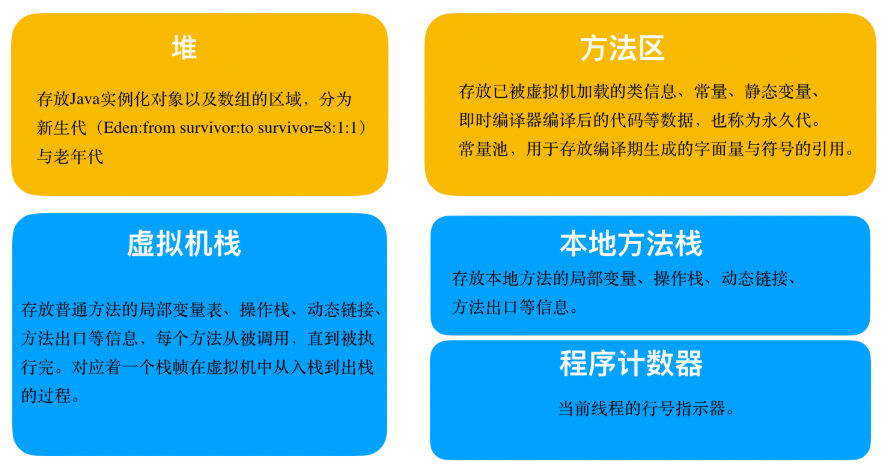

## jvm 运行时数据区域

    

**线程共享区域**

堆：Java堆（JavaHeap）是Java虚拟机所管理的内存中最大的一块。Java堆是被所有线程共享的一块内存区域，在虚拟机启动时创建。此内存区域的唯一目的就是`存放对象实例与数组`，几乎所有的对象实例都在这里分配内存。`Java堆是垃圾收集器管理的主要区域`，因此很多时候也被称做“GC堆”。从内存回收的角度来看，由于现在收集器基本都采用分代收集算法，所以Java堆中还可以细分为：新生代和老年代；再细致一点的有Eden空间、From Survivor空间、ToSurvivor空间，比例为 8 ：1 ：1 。

方法区（MethodArea）: 与Java堆一样，是各个线程共享的内存区域，它`用于存储已被虚拟机加载的类信息、常量、静态变量、即时编译器编译后的代码等数据`。虽然Java虚拟机规范把方法区描述为堆的一个逻辑部分，但是它却有一个别名叫做Non-Heap（非堆），目的应该是与Java堆区分开来。运行时常量池（Runtime ConstantPool）是方法区的一部分。Class文件中除了有类的版本、字段、方法、接口等描述信息外，还有一项信息是常量池（Constant PoolTable），`用于存放编译期生成的各种字面量和符号引用，这部分内容将在类加载后进入方法区的运行时常量池中存放。`

**线程私有区域**

程序计数器（Program CounterRegister）: 是一块较小的内存空间，它可以看作是当前线程所执行的字节码的行号指示器。在虚拟机的概念模型里（仅是概念模型，各种虚拟机可能会通过一些更高效的方式去实现），字节码解释器工作时就是通过改变这个计数器的值来选取下一条需要执行的字节码指令，分支、循环、跳转、异常处理、线程恢复等基础功能都需要依赖这个计数器来完成。如果正在执行的是Native方法，这个计数器值则为空（Undefined）。

Java虚拟机栈（Java Virtual MachineStacks）:也是线程私有的，它的生命周期与线程相同。虚拟机栈描述的是Java方法执行的内存模型：`每个方法在执行的同时都会创建一个栈帧（Stack Frame）用于存储局部变量表、操作数栈、动态链接、方法出口等信息。每一个方法从调用直至执行完成的过程，就对应着一个栈帧在虚拟机栈中入栈到出栈的过程。`

本地方法栈（Native MethodStack）: 与虚拟机栈所发挥的作用是非常相似的，它们之间的区别不过是虚拟机栈为虚拟机执行Java方法（也就是字节码）服务，而本地方法栈则为虚拟机使用到的Native方法服务。

## 垃圾回收

垃圾回收发生的区域： java 堆；

垃圾回收做哪些事情？

1. 哪些内存需要回收？
2. 什么时候回收？
3. 如何回收？

### 哪些内存需要回收？

对已经“死去”的对象进行回收，即这些对象已不在被引用，如何判断对象是否被引用有两种方式：

- 引用计数法
- 可达性分析算法

**引用计数算法**

给对象中添加一个引用计数器，每当有一个地方引用它时，计数器值就加1；当引用失效时，计数器值就减1；任何时刻计数器为0的对象就是不可能再被使用的。

缺点：主流的Java虚拟机里面没有选用引用计数算法来管理内存，其中最主要的原因是它很难解决对象之间相互循环引用的问题。

**可达性分析算法**

通过一系列的称为“GCRoots”的对象作为起始点，从这些节点开始向下搜索，搜索所走过的路径称为引用链（Reference Chain），当一个对象到GCRoots没有任何引用链相连（用图论的话来说，就是从GCRoots到这个对象不可达）时，则证明此对象是不可用的。

在Java语言中，可作为GC Roots的对象包括下面几种：

- 虚拟机栈（栈帧中的本地变量表）中引用的对象。
- 方法区中类静态属性引用的对象。
- 方法区中常量引用的对象。
- 本地方法栈中JNI（即一般说的Native方法）引用的对象。

