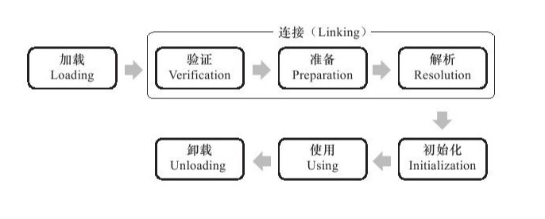
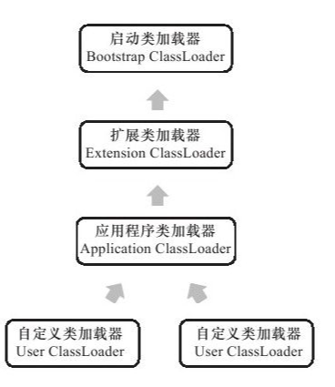

**什么是类加载机制？**

类的加载指的是将类的.class文件中的二进制数据读入到内存中，并对数据进行校验、转换解析和初始化，将其放在运行时数据区的方法区内，然后在堆区创建一个 java.lang.Class对象，用来封装类在方法区内的数据结构。最终形成可以被虚拟机直接使用的Java类型，这就是虚拟机的类加载机制。

**jvm 的类加载有什么特点？**

与那些在编译时需要进行连接工作的语言不同，在Java语言里面，类型的加载、连接和初始化过程都是在程序运行期间完成的，这种策略虽然会令类加载时稍微增加一些性能开销，但是会为Java应用程序提供高度的灵活性，Java里天生可以动态扩展的语言特性就是依赖运行期动态加载和动态连接这个特点实现的。

## 类加载的时机

类从被加载到虚拟机内存中开始，到卸载出内存为止，它的整个生命周期包括：加载（Loading）、验证（Verification）、准备（Preparation）、解析（Resolution）、初始化（Initialization）、使用（Using）和卸载（Unloading）7个阶段。其中验证、准备、解析3个部分统称为连接（Linking）。

    

加载、验证、准备、初始化和卸载这5个阶段的顺序是确定的，类的加载过程必须按照这种顺序按部就班地开始，而解析阶段则不一定：它在某些情况下可以在初始化阶段之后再开始，这是为了支持Java语言的运行时绑定（也称为动态绑定或晚期绑定）。

**什么时候开始第一阶段，加载，和第五阶段，初始化？**

加载，在Java虚拟机规范中并没有进行强制约束，这点可以交给虚拟机的具体实现来自由把握。但是对于初始化阶段，虚拟机规范则是严格规定了有且只有5种情况必须立即对类进行“初始化”：

1）遇到new、getstatic、putstatic或invokestatic这4条字节码指令时，如果类没有进行过初始化，则需要先触发其初始化。生成这4条指令的最常见的Java代码场景是：使用new关键字实例化对象的时候、读取或设置一个类的静态字段（被final修饰、已在编译期把结果放入常量池的静态字段除外）的时候，以及调用一个类的静态方法的时候。

2）使用java.lang.reflect包的方法对类进行反射调用的时候，如果类没有进行过初始化，则需要先触发其初始化。

3）当初始化一个类的时候，如果发现其父类还没有进行过初始化，则需要先触发其父类的初始化。

4）当虚拟机启动时，用户需要指定一个要执行的主类（包含main（）方法的那个类），虚拟机会先初始化这个主类。

`类加载的数据存放在 jvm 运行时区域的堆和方法区，存储的方式如下：`

- 堆，存储实例化对象和数组
- 方法区，存储类信息、常量、静态变量

## 类加载不同阶段所做的事情

### 加载

“类加载”（ClassLoading）过程的一个阶段，在加载阶段，虚拟机需要完成以下3件事情：

1）通过一个类的全限定名来获取定义此类的二进制字节流。
2）将这个字节流所代表的静态存储结构转化为方法区的运行时数据结构。
3）在内存(堆)中生成一个代表这个类的java.lang.Class对象，作为方法区这个类的各种数据的访问入口。

### 验证

连接阶段的第一步，这一阶段的目的是为了确保Class文件的字节流中包含的信息符合当前虚拟机的要求，并且不会危害虚拟机自身的安全。验证阶段大致上会完成下面4个阶段的检验动作：文件格式验证、元数据验证、字节码验证、符号引用验证。

### 准备

准备阶段是正式为`类变量（static 变量）`分配内存并设置类变量初始值的阶段，这些变量所使用的内存都将在`方法区`中进行分配。这个阶段中有两个容易产生混淆的概念需要强调一下，首先，这时候进行内存分配的仅包括类变量（被static修饰的变量），而不包括实例变量，实例变量将会在对象实例化时随着对象一起分配在Java堆中。其次，`这里所说的初始值“通常情况”下是数据类型的零值`。

### 解析

解析阶段是虚拟机将常量池内的符号引用替换为直接引用的过程，包括类或接口的解析、字段解析、类方法解析、接口方法解析。

### 初始化

类初始化阶段是类加载过程的最后一步，前面的类加载过程中，除了在加载阶段用户应用程序可以通过自定义类加载器参与之外，其余动作完全由虚拟机主导和控制。到了初始化阶段，才真正开始执行类中定义的Java程序代码（或者说是字节码）。
在准备阶段，变量已经赋过一次系统要求的初始值，而在初始化阶段，则根据程序员通过程序制定的主观计划去初始化类变量和其他资源。

## 类加载器

### 类加载器的作用

1. 加载类
2. 确定类的唯一性：对于任意一个类，都需要由加载它的类加载器和这个类本身一同确立其在Java虚拟机中的唯一性，每一个类加载器，都拥有一个独立的类名称空间。

### 双亲委派模型

从Java虚拟机的角度来讲，只存在两种不同的类加载器：

1. 一种是启动类加载器（Bootstrap ClassLoader），这个类加载器使用C++语言实现 ，是虚拟机自身的一部分；
2. 另一种就是所有其他的类加载器，这些类加载器都由Java语言实现，独立于虚拟机外部，并且全都继承自抽象类java.lang.ClassLoader。

从Java开发人员的角度来看，主要存在以下三种类加载器：

1. 启动类加载器（BootstrapClassLoader）：前面已经介绍过，这个类将器负责将存放在`＜JAVA_HOME＞\lib`目录中的，或者被-Xbootclasspath参数所指定的路径中的，并且是虚拟机识别的（仅按照文件名识别，如rt.jar，名字不符合的类库即使放在lib目录中也不会被加载）类库加载到虚拟机内存中。启动类加载器无法被Java程序直接引用。

2. 扩展类加载器（Extension ClassLoader）：这个加载器由sun.misc.Launcher$ExtClassLoader实现，它负责加载`＜JAVA_HOME＞\lib\ext`目录中的，或者被java.ext.dirs系统变量所指定的路径中的所有类库，开发者可以直接使用扩展类加载器。

3. 应用程序类加载器（ApplicationClassLoader）：这个类加载器由sun.misc.Launcher$App-ClassLoader实现。由于这个类加载器是ClassLoader中的getSystemClassLoader（）方法的返回值，所以一般也称它为系统类加载器。它`负责加载用户类路径（ClassPath）上所指定的类库`，开发者可以直接使用这个类加载器，如果应用程序中没有自定义过自己的类加载器，一般情况下这个就是程序中`默认的类加载器`。

    

双亲委派模型要求除了顶层的启动类加载器外，其余的类加载器都应当有自己的父类加载器。这里类加载器之间的父子关系一般不会以继承（Inheritance）的关系来实现，而是都使用组合（Composition）关系来复用父加载器的代码。

双亲委派模型的工作过程是：如果一个类加载器收到了类加载的请求，它首先不会自己去尝试加载这个类，而是把这个请求委派给父类加载器去完成，每一个层次的类加载器都是如此，因此所有的加载请求最终都应该传送到顶层的启动类加载器中，只有当父加载器反馈自己无法完成这个加载请求（它的搜索范围中没有找到所需的类）时，子加载器才会尝试自己去加载。

**为什么要使用双亲委派模型？**

使用双亲委派模型来组织类加载器之间的关系，有一个显而易见的好处就是Java类随着它的类加载器一起具备了一种带有优先级的层次关系。例如类java.lang.Object，它存放在rt.jar之中，无论哪一个类加载器要加载这个类，最终都是委派给处于模型最顶端的启动类加载器进行加载，因此Object类在程序的各种类加载器环境中都是同一个类。相反，如果没有使用双亲委派模型，由各个类加载器自行去加载的话，如果用户自己编写了一个称为java.lang.Object的类，并放在程序的ClassPath中，那系统中将会出现多个不同的Object类，Java类型体系中最基础的行为也就无法保证，应用程序也将会变得一片混乱。

**如何破坏双亲委派模型？**

不遵守子类加载器调用父类加载器。有过的三种方式：

1. jdk1.2 之前可覆盖双亲委派模型的逻辑代码，用户自己实现；
2. 线程上下文类加载器（Thread ContextClassLoader），父类加载器去调用子类加载器；
3. OSGi实现模块化热部署的关键则是它自定义的类加载器机制的实现。每一个程序模块（OSGi中称为Bundle）都有一个自己的类加载器，当需要更换一个Bundle时，就把Bundle连同类加载器一起换掉以实现代码的热替换。

**为什么要破坏双亲委派模型？**

为了实现用户自定义的一些功能，如热代码、SPI模式等。
