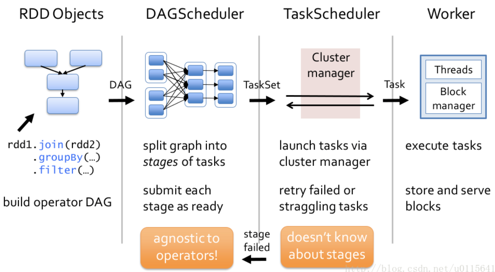

## 介绍

DAG，有向无环图，Directed Acyclic Graph的缩写，常用于建模。Spark中使用DAG对RDD的关系进行建模，描述了RDD的依赖关系，这种关系也被称之为lineage，RDD的依赖关系使用Dependency维护，DAG在Spark中的对应的实现为DAGScheduler。

    

## DAGScheduler作用

1. compute DAG，执行DAG，得到stage和对应的task，通过TaskScheduler提交到集群
2. preferred locations，就近执行。 根据 cache 信息和 RDD 的 preferred Locations 获取 preferred location。 
3. fault-tolerant，stage 级别的容错。shuffle结束后，reducer 读取 map 的输出，如果读取失败，会触发DAGScheduler重新提交对应的Stage。

