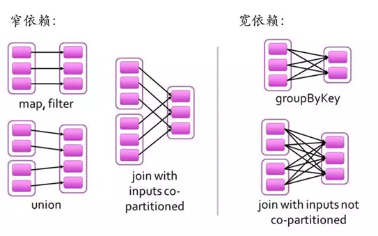
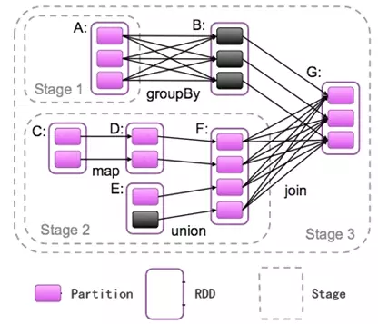
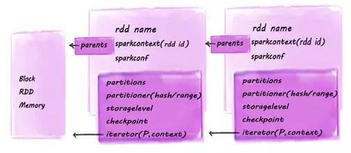

## overview

The `main abstraction` Spark provides is a `resilient distributed dataset (RDD)`, which is a collection of elements partitioned across the nodes of the cluster that can be operated on in parallel. RDDs are created by starting with a file in the Hadoop file system (or any other Hadoop-supported file system), or an existing Scala collection in the driver program, and transforming it. Users may also ask Spark to persist an RDD in memory, allowing it to be reused efficiently across parallel operations. Finally, RDDs automatically recover from node failures.

A `second abstraction` in Spark is `shared variables` that can be used in parallel operations. By default, when Spark runs a function in parallel as a set of tasks on different nodes, it ships a copy of each variable used in the function to each task. Sometimes, a variable needs to be shared across tasks, or between tasks and the driver program. Spark supports two types of shared variables: `broadcast variables`, which can be used to cache a value in memory on all nodes, and `accumulators`, which are variables that are only “added” to, such as counters and sums.

## ????

RDD????????????(Resilient Distributed Datasets)??????????????`??????????????`????????RDD?????????RDD?????????(?map, join, filter, groupBy?)????????????RDD?????????RDDs????????????RDDs??????????`??RDDs??????RDDs??????????DAG??DAG????????????`?????????RDD???????(Lineage)????????????????????????????????????`??RDD????????????????????(????????)??????????????????????DAG??????????`??RDD??????????????????????????????????????????????????(?????????)????????????

## ??

??????RDD????????????????????????????????compute??????????????RDD??????????????compute??????????????????RDD?????RDD??????compute????????????RDD????????

    

## RDD?????

???????????????????RDD?RDD???????????????????????????????????RDD???????????RDD??????????????narrow dependency?????????RDD?????????RDD??????????????wide dependency?????`???????????RDD????????????????????????`???????????

    

**???Spark???????????**

??????????????????????????????????????????????map?filter??????????????????????????groupByKey???????MR?shuffle???
?????????????????????????????????RDD????????????????????????????????????RDD????????????????

??? ???????????Stage?`Stage???????????RDD?????????????`???RDD??????????????????Stage?????RDD??????????????????Stage???Spark??????????Stage???, ?????????????????RDD?-A?RDD-B?RDD-F?RDD-G??????????????RDD???????Stage??

    

## RDD ????

RDD ????????rddname?sparkcontext?sparkconf?parent?dependency?partitioner?checkpoint?storageLevel??

    

**rddname**

rdd???

**sparkcontext**

SparkContext?Spark job?????Spark driver???client?????????RddID??????????????????

**sparkconf**

Spark??????,?????????????
1. Spark api?????????????????SparkConf????Java??????
2. ??????????????conf/spark-env.sh???????IP????????
3. ?????????log4j.properties??

**parent**

?????RDD?partition id???dependencies???????RDD????partiton id?List????????parents?

**iterator**

??????????RDD Partition??RDD?Partition?????????StorageLevel?????????????????????????checkpoint???RDD??? ??StorageLevel?NONE???computeOrReadCheckpoint?????????????????????checkpoint????????????????????????Storagelevel????????????RDD?????????RDD??????????????????????????????????????????????????

**prisist**

rdd???level????storagelevel?????????storagelevel?? 5??? ?useDisk,useMemory, useOffHeap, deserialized, replication ??????

## ?????
> 
> https://www.jianshu.com/p/dd7c7243e7f9?from=singlemessage
> 
> http://sharkdtu.com/posts/spark-rdd.html
> 
> https://blog.csdn.net/qq_31598113/article/details/70832701