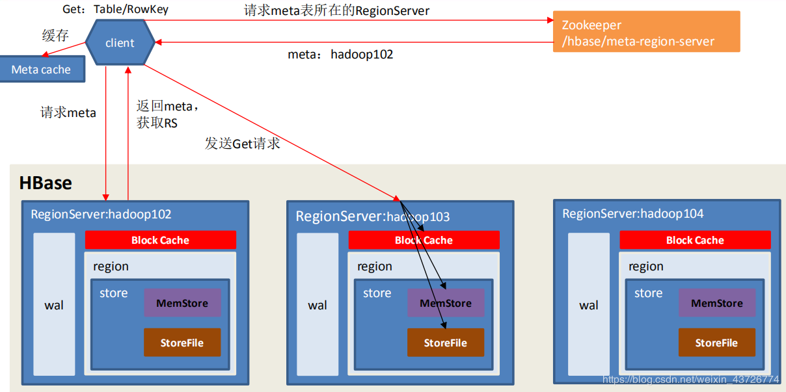
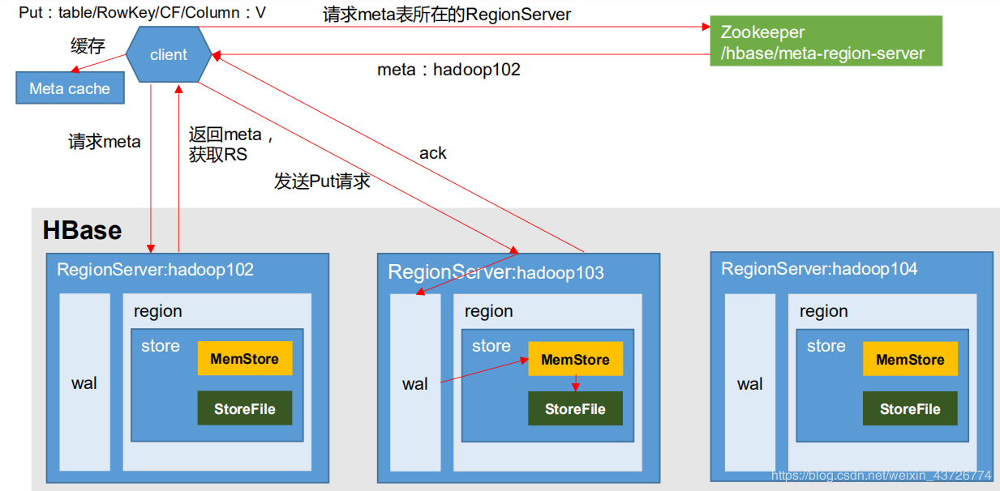

## hbase 读操作

Block Cache：读缓存（如果是从StoreFile里面读取的数据，不是直接返回给客户端，而是先写入BlockCache，再返回给客户端。）作用是：读数据是会扫描磁盘的，本身很慢。所以用一个读缓存来加速查询。当读缓存中的数据量很大的时候会根据LRU算法删除一些数据。

LRU：最近最少使用

1. 先从客户端缓存获取 hbase:meta 表的位置，若获取不到则进行第 2 步；
2. Client 访问 zookeeper，获取 hbase:meta 表位于哪个 Region Server。访问对应的 Region Server，获取 hbase:meta 表，根据读请求的 namespace:table/rowkey，查询出目标数据位于哪个 Region Server 中的哪个 Region 中。并将该 table 的 region 信息以及 meta 表的位置信息缓存在客户端的 meta cache，方便下次访问。
3. 与目标 Region Server 进行通讯。
4. 分别在 Block Cache（读缓存），MemStore 和 Store File中查询目标数据，并将查到的所有数据进行合并（marge）。此处所有数据是指同一条数据的不同版本（time stamp）或者不同的类型（Put/Delete），然后返回时间戳大的一条数据。
5. 将从文件中查询到的数据块缓存到Block Cache。
6. 将合并后的最终结果返回给客户端。

    

## hbase 写流程

1. Client 先访问 zookeeper，获取 hbase:meta 表位于哪个 Region Server（保存在了zookeeper的/hbase/meta-region-server中）。
2. 访问对应的 Region Server，获取 hbase:meta 表，根据读请求的 namespace:table/rowkey，查询出目标表位于哪个 Region Server 中的哪个 Region 中。并将该 table 的 region 信息以及 meta 表的位置信息缓存在客户端的 meta cache，方便下次访问。 
3. 与table所在的 Region Server 进行通讯。
4. 将数据顺序写入（追加）到 WAL（预写入日志）以便在服务器没有flush到storefile时宕机通过wal进行数据重建。
5. 将数据写入对应的 MemStore，数据会在 MemStore 进行排序。
6. 向客户端发送 ack。
7. 等达到 MemStore 的刷写时机后，将数据刷写到 StoreFile。

    

参考：  
> https://www.cnblogs.com/Rabcheng/p/12795413.html