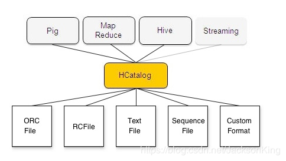

HCatalog是Hadoop的表和存储管理层，允许使用不同数据处理工具(Pig和MapReduce)的用户更容易地在网格上读写数据。HCatalog的表抽象为用户提供了Hadoop分布式文件系统(HDFS)中数据的关系视图，并确保用户不必担心数据存储在何处或以何种格式存储——RCFile格式、文本文件、SequenceFiles或ORC文件。

HCatalog支持以任何可以编写SerDe(序列化器-反序列化器)的格式读写文件。默认情况下，HCatalog支持RCFile、CSV、JSON、SequenceFile和ORC文件格式。要使用自定义格式，必须提供InputFormat、OutputFormat和SerDe。

    

