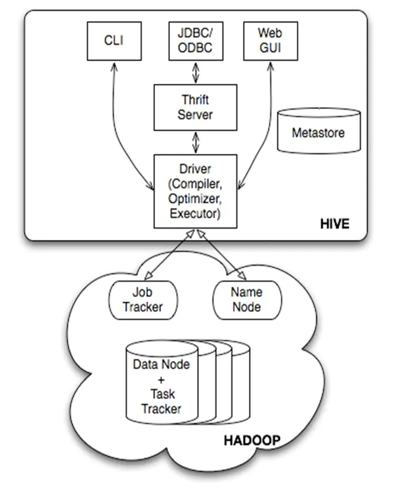
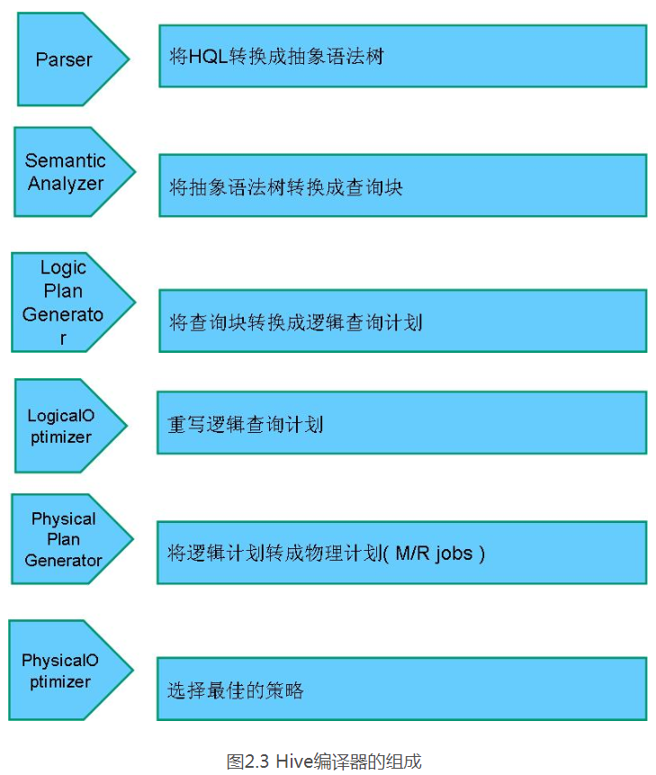
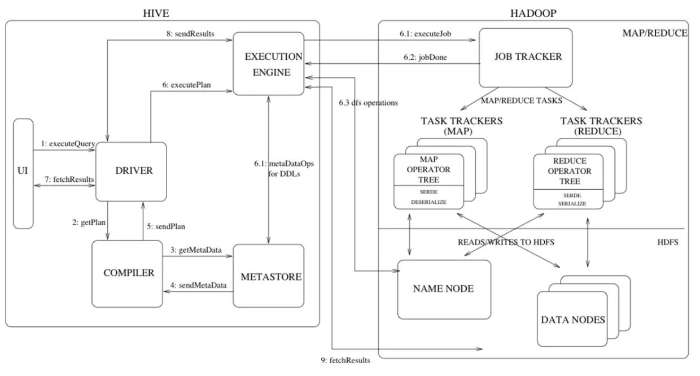

# hive详解

本文内容：

1. hive的产生背景；
2. hive的架构；
3. hive工作流程
4. hive数据组织。

## 为什么需要hive？

传统的关系型数据库如mysql等，由于存在*性能*与*单点问题*在面对大批量数据的查询与聚合计算等操作时无法满足需求，甚至无法得出结果。而Hive则依托于Hadoop平台将查询计算等任务分解成为一个个小的MapReduce任务，分布式的跑在多台服务器上，解决了单点与性能的问题，需要注意的是hive的应用场景是进行大规模的批量查询与计算。

## hive是如何做的？

hive提供了类SQL的HSQL给用户进行查询操作，使得传统数据库从业人员可以很快的上手，那么hive对一个用HSQL编写的查询任务是如何进行处理的呢？先看hive的整体架构图：

    

**CLI** :命令行操作接口；

**JDBC/ODBC**: java 客户端操作接口；

**Web GUI**: 可视化界面；

**Metastore**: 元数据存储数据库，存储如表名、列名称、分区、表数据目录等信息；

**Driver**: 对查询任务进行解析、编译、执行，最终生成查询计划把任务分解到Hadoop平台进行执行。

其中最核心的部分为**MetaStore**与**Driver**，由于元数据的量不会发展成海量所以metastore通常使用mysql进行持久化存储，driver主要的工作如下图所示：

    

## hive工作流程

下图描绘了从输入HSQL语句到hive执行后返回结构的全部流程：

    

以下为执行说明：

1.Execute Query：hive界面如命令行或Web UI将查询发送到Driver (任何数据库驱动程序如JDBC、ODBC,等等)来执行。

2.Get Plan:Driver根据查询编译器解析query语句,验证query语句的语法,查询计划或者查询条件。

3.Get Metadata：编译器将元数据请求发送给Metastore(任何数据库)。

4.Send Metadata：Metastore将元数据作为响应发送给编译器。

5.Send Plan：编译器检查要求和重新发送Driver的计划。到这里,查询的解析和编译完成。

6.Execute Plan:Driver将执行计划发送到执行引擎。

7.Execute Job:hadoop内部执行的是mapreduce工作过程,任务执行引擎发送一个任务到资源管理节点(resourcemanager)，资源管理器分配该任务到任务节点，由任务节点上开始执行mapreduce任务。

7.1Metadata Ops：在执行引擎发送任务的同时,对hive的元数据进行相应操作。

8.Fetch Result：执行引擎接收数据节点(data node)的结果。

9.Send Results:执行引擎发送这些合成值到Driver。

10.Send Results：Driver将结果发送到hive接口。

## hive 数据组织

Hive 中所有的数据都存储在 HDFS 中，没有专门的数据存储格式，因为 **Hive 是读模式** （Schema On Read），可支持 TextFile，SequenceFile，RCFile 或者自定义格式等。Hive 的存储结构包括**数据库、表、视图、分区和表数据**等：

- **database**：在 HDFS 中表现为${hive.metastore.warehouse.dir}目录下一个文件夹

- **table**：在 HDFS 中表现所属 database 目录下一个文件夹

- **external table**：与 table 类似，不过其数据存放位置可以指定任意 HDFS 目录路径

- **partition**：在 HDFS 中表现为 table 目录下的子目录

- **bucket**：在 HDFS 中表现为同一个表目录或者分区目录下根据某个字段的值进行 hash 散 列之后的多个文件

- **view**：与传统数据库类似，只读，基于基本表创建

Hive 中的表分为内部表、外部表、分区表和 Bucket 表**内部表和外部表的区别：**

- **删除内部表时，同时删除表元数据和数据**

- **删除外部表，仅删除元数据不删除数据**

**分区表和分桶表的区别：** 

　　Hive 数据表可以根据某些字段进行分区操作，细化数据管理，可以让部分查询更快。同 时表和分区也可以进一步被划分为 Buckets，分桶表的原理和 MapReduce 编程中的 HashPartitioner 的原理类似。分区和分桶都是细化数据管理，但是分区表是手动添加区分，由于 Hive 是读模式，所 以对添加进分区的数据不做模式校验，分桶表中的数据是按照某些分桶字段进行 hash 散列 形成的多个文件，所以数据的准确性也高很多

**参考来源：**  
> https://juejin.im/post/5b2c5c4d51882574af2813a0  
> https://blog.csdn.net/haramshen/article/details/52606666  
> https://blog.csdn.net/zhoudaxia/article/details/8855937  
> https://www.cnblogs.com/qingyunzong/p/8707885.html

