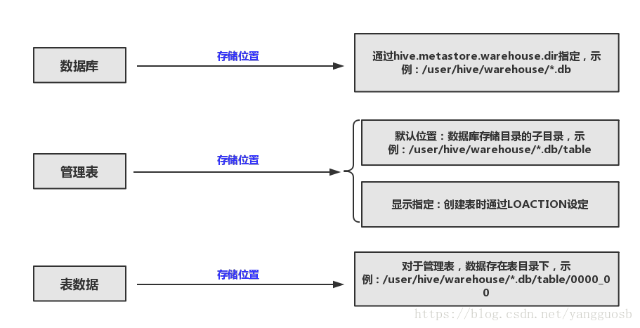
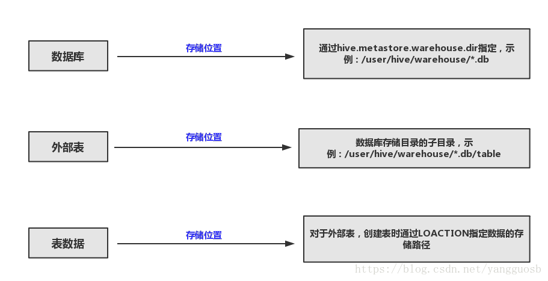
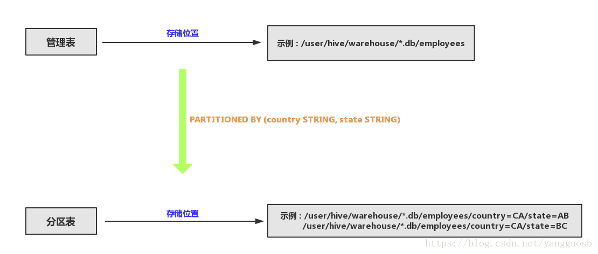

# hive 表

1. hive 表类型
2. 创建hive表
3. hive表优化

## hive 表类型

**内部表（管理表）**

1. 表数据存储在管理表的存储目录下；
2. 删除管理表时，元数据和表数据都会被删除；

<div align="center">
    
</div>

**外部表**

1. 表数据为已经在HDFS中存在的数据，外部表的目录并没有数据（相当于一个链接）；
2. 删除外部表时，只会删除元数据，并不会删除表数据；

使用场景：共享数据场景（同一份数据可能被多个工具分析使用）

<div align="center">
    
</div>

**分区表**

作用：用于提高查询速度；  
原理：将数据按照分区条件分组存储  

<div align="center">
    
</div>

**分桶表**

桶是更细粒度的划分， 相同的数据分到一个桶里面，减少数据访问的量，对每一个表或者分区，hive可以进行进一步的分桶
 
对列的值哈希然后除以桶的个数求与的方式决定这条数据放到哪个桶里面去。
 
1. 分桶可以获得更高查询效率  
2. 桶为表加上了额外的结构，hive查询的时候可以利用这种结构  
   
两个表连接时相同的列上划分了桶的表可以使用map端进行连接，join连接时两个表有相同的列，如果这两个表都进行了桶的操作，那么这个保存相同列值得桶进行join操作就可以减少join的数量
 
 
分桶需要设置两个参数：  
set hive.enforce.bucketing=true;  
set hive.enforce.sorting=true;


## 创建 hive 表命令

**创建内部表**
```sql
create table test_db.test_table (
    id int unique comment 'col comment',
    name String not null comment 'col comment2',
    create_date Date,
) 
comment 'table comment' 
partitioned by (create_date Date)
ROW FORMAT DELIMITED FIELDS TERMINATED BY ',' 
TBLPROPERTIES ('creator'='szh', 'crate_time'='2018-06-07')
```


**创建外部表**
```sql
create EXTERNAL table test_db.test_table (
    id int unique comment 'col comment',
    name String not null comment 'col comment2',
    create_date Date,
) comment 'table comment' partitioned by create_date location hdfs_path
```


**创建分桶表**
```sql
create table bck_student(
    id int,name string,sex string, age int,department string
) 
clustered by(sex) into 2 buckets 
row format delimited fields terminated  by ",";
```

参考：

> [表类型](https://blog.csdn.net/yangguosb/article/details/81781564)  
> [分桶表](https://www.cnblogs.com/zwgblog/p/7083911.html)