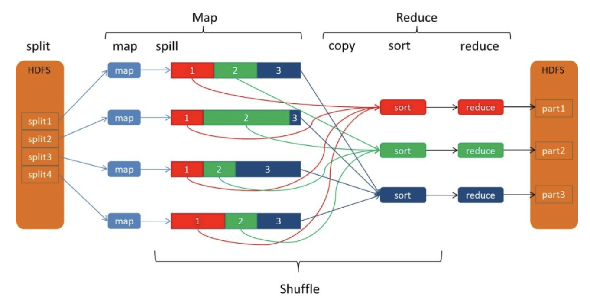
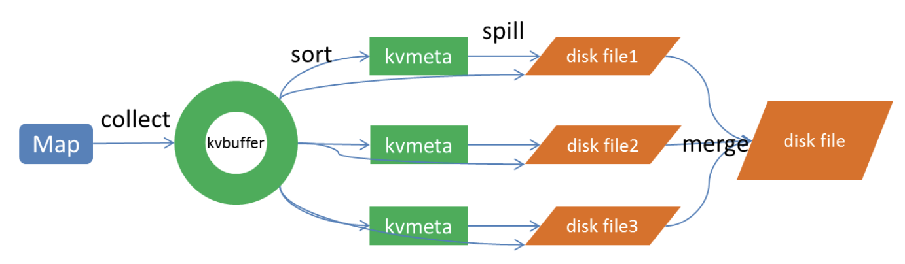
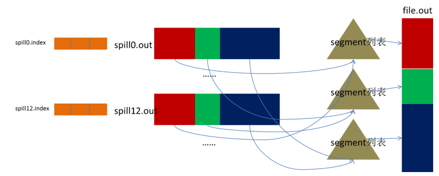
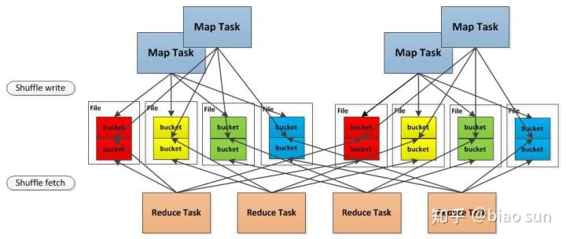
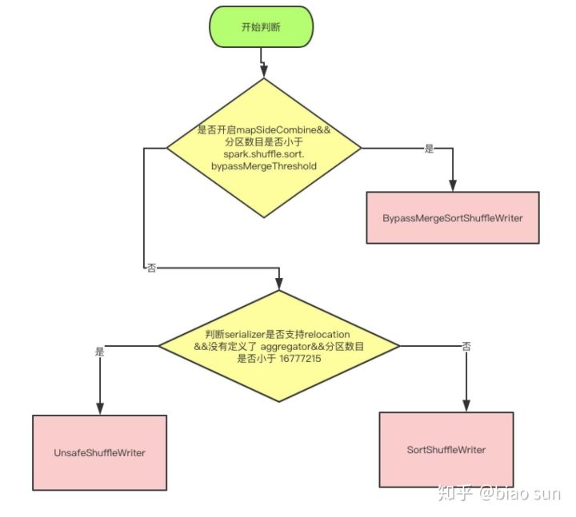

# hadoop mapreduce 与 spark mapreduce 对比

## hadoop mapreduce

> 引用：blog.csdn.net/u010697988/article/details/70173104

mapreduce 基于“映射”与“归约”的思想，将一堆杂乱无序的数据根据某种特征归纳起来，并行处理之后得到最终的结果。`mapreduce 的编程思想是用于解决一个大问题可以分解为多个小问题，并且这些小问题相互独立的场景，所有的小问题处理完大问题也将处理完成`。如下图所示：

    

Map 任务与 Reduce 任务的连接是由中间的 Shuffle 过程完成。Shuffle 过程中，Map 任务处理完的数据经过 `collect(收集)、 sort (排序) 、spill(溢写)、merge(合并)`步骤写入到磁盘文件中，reduce 任务则将对应的磁盘文件进行 `copy、merge sort` 步骤拷贝到指定主机进行合并排序，以此完成数据的处理。如下图所示：

    

### Map 任务端 shuffle

    

**Collect**

每个Map任务不断地以对的形式把数据输出到在内存中构造的一个环形数据结构中。使用环形数据结构是为了更有效地使用内存空间，在内存中放置尽可能多的数据。

**Sort**

先把Kvbuffer中的数据按照partition值和key两个关键字升序排序，移动的只是索引数据，排序结果是Kvmeta中数据按照 partition 为单位聚集在一起，同一 partition内的按照key有序。`parttion 是由reduce任务数决定，是为了均衡每个 reduce 任务的负载，partition 的分配是按照 key 的 hash 值取模决定的，因此每个 parttion 中可能包含多种 key 值。`

**Spill**

Spill线程为这次Spill过程创建一个磁盘文件：从所有的本地目录中轮训查找能存储这么大空间的目录，找到之后在其中创建一个类似于 “spill12.out”的文件。Spill线程根据排过序的Kvmeta挨个partition的把数据吐到这个文件中(顺序写入磁盘)，一个partition对应的数据吐完之后顺序地吐下个partition，直到把所有的partition遍历 完。一个partition在文件中对应的数据也叫段(segment)。

**Merge**

Map任务如果输出数据量很大，可能会进行好几次Spill，out文件和Index文件会产生很多，分布在不同的磁盘上，所以需要 merge 过程。每个partition对应一个段列表，记录所有的Spill文件中对应的这个partition那段数据的文 件名、起始位置、长度等等。然后对这个partition对应的所有的segment进行合并，目标是合并成一个segment。当这个 partition对应很多个segment时，会分批地进行合并：先从segment列表中把第一批取出来，以key为关键字放置成最小堆，然后从最小 堆中每次取出最小的输出到一个临时文件中，这样就把这一批段合并成一个临时的段，把它加回到segment列表中；再从segment列表中把第二批取出 来合并输出到一个临时segment，把其加入到列表中；这样往复执行，直到剩下的段是一批，输出到最终的文件中。

    

### reduce 端 shuffle

**Copy**

Reduce 任务通过HTTP向各个Map任务拖取它所需要的数据。每个节点都会启动一个常驻的HTTP server，其中一项服务就是响应Reduce拖取Map数据。当有MapOutput的HTTP请求过来的时候，HTTP server就读取相应的Map输出文件中对应这个Reduce部分的数据通过网络流输出给Reduce。

Reduce任务拖取某个Map 对应的数据，如果在内存中能放得下这次数据的话就直接把数据写到内存中。Reduce要向每个Map去拖取数据，在内存中每个Map对应一块数据，当内存 中存储的Map数据占用空间达到一定程度的时候，开始启动内存中merge，把内存中的数据merge输出到磁盘上一个文件中。

如果在内存 中不能放得下这个Map的数据的话，直接把Map数据写到磁盘上，在本地目录创建一个文件，从HTTP流中读取数据然后写到磁盘，使用的缓存区大小是 64K。拖一个Map数据过来就会创建一个文件，当文件数量达到一定阈值时，开始启动磁盘文件merge，把这些文件合并输出到一个文件。

有些Map的数据较小是可以放在内存中的，有些Map的数据较大需要放在磁盘上，这样最后Reduce任务拖过来的数据有些放在内存中了有些放在磁盘上，最后会对这些来一个全局合并。

**Merge Sort**

这里使用的Merge和Map端使用的Merge过程一样。Map的输出数据已经是有序的，Merge进行一次合并排序，所谓Reduce端的 sort过程就是这个合并的过程。一般Reduce是一边copy一边sort，即copy和sort两个阶段是重叠而不是完全分开的。

## spark mapreduce

1. Spark 0.8及以前 Hash Based Shuffle
2. Spark 0.8.1 为Hash Based Shuffle引入File Consolidation机制
3. Spark 0.9 引入ExternalAppendOnlyMap
4. Spark 1.1 引入Sort Based Shuffle，但默认仍为Hash Based Shuffle
5. Spark 1.2 默认的Shuffle方式改为Sort Based Shuffle
6. Spark 1.4 引入Tungsten-Sort Based Shuffle
7. Spark 1.6 Tungsten-sort并入Sort Based Shuffle
8. Spark 2.0 Hash Based Shuffle退出历史舞台

### Hash Based Shuffle(0.8,0.8.1,0.9)

每一个Mapper会根据Reducer的数量创建出相应的bucket，bucket的数量是`(M * R)` ，其中M是Map的个数，R是Reduce的个数。这样会产生大量的小文件，对文件系统压力很大，而且也不利于IO吞吐量，如下图：

    

优化后，使用 Consolidation机制，把在统一core上运行的多个Mapper 输出的合并到同一个文件，这样文件数目就变成了` (cores * R)` 个,`cores 为 CPU 核数`,如下图：

    

### spark 2.1 版本的 shuffle

> 引用：https://zhuanlan.zhihu.com/p/55954840

现在2.1 分为三种writer， 分为 BypassMergeSortShuffleWriter， SortShuffleWriter 和 UnsafeShuffleWriter，使用条件如下图：

    

上面是使用哪种 writer 的判断依据， 是否开启 mapSideCombine 这个判断，是因为有些算子会在 map 端先进行一次 combine， 减少传输数据。 因为 BypassMergeSortShuffleWriter 会临时输出Reducer个（分区数目）小文件，所以分区数必须要小于一个阀值 `spark.shuffle.sort.bypassMergeThreshold，默认是小于200。`

**UnsafeShuffleWriter**

UnsafeShuffleWriter需要Serializer支持relocation，Serializer支持relocation：原始数据首先被序列化处理，并且再也不需要反序列，在其对应的元数据被排序后，需要Serializer支持relocation，在指定位置读取对应数据。

**BypassMergeSortShuffleWriter**

BypassMergeSortShuffleWriter和Hash Shuffle中的HashShuffleWriter实现基本一致， 唯一的区别在于，map端的多个输出文件会被汇总为一个文件。 所有分区的数据会合并为同一个文件，会生成一个索引文件，是为了索引到每个分区的起始地址，可以随机 access 某个partition的所有数据。

    

`需要注意的是，这种方式不宜有太多分区，因为过程中会并发打开所有分区对应的临时文件，会对文件系统造成很大的压力。`

具体实现就是给每个分区分配一个临时文件，对每个 record 的key 使用分区器（模式是hash，如果用户自定义就使用自定义的分区器）找到对应分区的输出文件句柄，直接写入文件，`没有在内存中使用 buffer`。 最后copyStream方法把所有的临时分区文件拷贝到最终的输出文件中，并且记录每个分区的文件起始写入位置，把这些位置数据写入索引文件中。

**SortShuffleWriter**

主要解决问题：在内存不够时，采用外部排序对外部大文件进行排序。例子：

> 1M内存只能装进1亿条数据，如何用 1M 内存对 100亿条数据进行排序？1M内存只能装进1亿条数据，每次都只能对这 1亿条数据进行排序，排好序后输出到磁盘，总共输出100个文件，最后怎么把这100个文件进行merge成一个全局有序的大文件？  
> 我们可以每个文件（有序的）都取一部分头部数据最为一个 buffer， 并且把这 100个 buffer放在一个堆里面，进行堆排序，比较方式就是对所有堆元素（buffer）的head元素进行比较大小， 然后不断的把每个堆顶的 buffer 的head 元素 pop 出来输出到最终文件中， 然后继续堆排序，继续输出。如果哪个buffer 空了，就去对应的文件中继续补充一部分数据。最终就得到一个全局有序的大文件。

`SortShuffleWriter 中的处理步骤是`:

1. 使用 PartitionedAppendOnlyMap 或者 PartitionedPairBuffer 在内存中进行排序， 排序的 K 是（partitionId， hash（key）） 这样一个元组。
2. 如果超过内存 limit，spill 到一个文件中，这个文件中元素也是有序的，首先是按照 partitionId的排序，如果 partitionId 相同， 再根据 hash（key）进行比较排序
3. 如果需要输出全局有序的文件的时候，就需要对之前所有的输出文件 和 当前内存中的数据结构中的数据进行 merge sort，进行全局排序

不同的地方在于，需要对 Key 相同的元素进行 aggregation， 就是使用定义的 func 进行聚合， 比如你的算子是 reduceByKey（+）, 这个func 就是加法运算， 如果两个key 相同， 就会先找到所有相同的key 进行 reduce(+) 操作，算出一个总结果 Result，然后输出数据（K，Result）元素。

