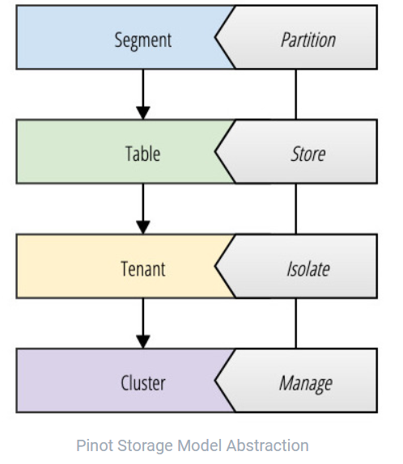
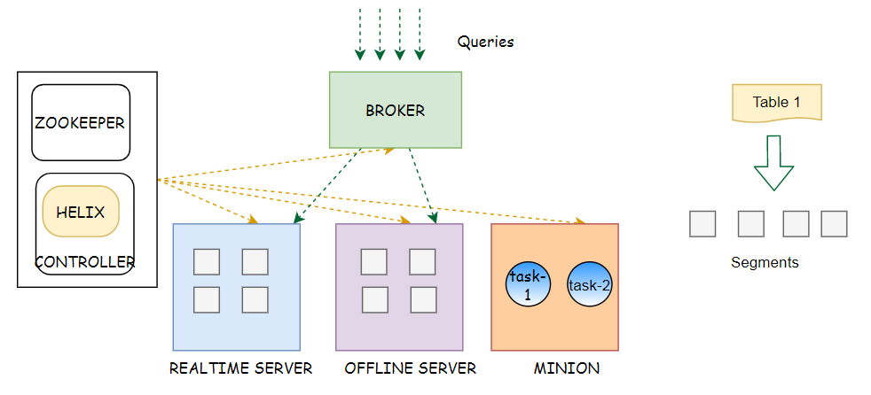

## Pinot 是什么？

Pinot是一个实时分布式OLAP数据存储，旨在以低延迟提供可扩展的实时分析。可以从 HDFS/S3/Kafka 等数据源获取数据。

    

虽然Pinot与数据库产品的典型模型不匹配，但最好根据您作为分析师、数据科学家或应用程序开发人员的角色来理解它。

**使用场景**  
Pinot旨在以低延迟执行OLAP查询。它适用于需要对不可变数据进行快速分析（如聚合）的上下文，可能需要实时数据摄取。

## 基本概念

Pinot旨在为大型数据集提供低延迟查询。为了达到这个性能，Pinot以列格式存储数据，并添加额外的索引来执行快速过滤、聚合和分组。

原始数据被分成小的数据碎片，每个碎片被转换成一个称为段的单元。一个或多个段一起形成一个表，表是使用SQL/PQL查询Pinot的逻辑容器。

    

**table**  

Pinot有一个表的概念——一个逻辑抽象，用来引用相关数据的集合。与RDBMS模式不同，可以在继承单个模式定义的Pinot（实时或批处理）中创建多个表。表是针对索引策略、分区、租户、数据源和/或复制等问题独立配置的。

**segment**  

Pinot有一个水平扩展的分布式系统架构。Pinot期望表的大小随着时间的推移无限增长。为了实现这一点，所有数据都需要分布在多个节点上。Pinot通过将数据分成更小的块（这类似于HA关系数据库中的碎片/分区）来实现这一点。段也可以看作是基于时间的分区。

**Tenant**  

为了支持多租户，Pinot为租户提供一流的支持。表与租户关联。这使得属于特定逻辑命名空间的所有表都可以分组到单个租户名称下，并与其他租户隔离。租户之间的这种隔离为应用程序和团队提供了不同的名称空间，以防止共享表或模式。构建应用程序的开发团队将永远不必操作Pinot的独立部署。一个组织可以操作一个集群，并随着新的租户增加查询总量而扩展它。开发人员可以管理自己的模式和表，而不受集群上任何其他租户的影响。

默认情况下，所有表都属于名为“default”的默认租户。租户的概念非常重要，因为它满足“每个服务/应用程序的数据库”的体系结构原则，而不必操作许多独立的数据存储。此外，租户将调度资源，以便段（shard）能够限制表的数据仅驻留在指定的一组节点上。与Linux容器中普遍使用的那种隔离类似，可以对Pinot中的计算资源进行调度，以防止租户之间的资源争用。

**Cluster**

从逻辑上讲，集群就是一组租户。与集群的经典定义一样，它也是一组计算节点的分组。通常，每个环境/数据中心只有一个集群。不需要创建多个集群，因为Pinot支持租户的概念。在LinkedIn，最大的Pinot集群由分布在数据中心的1000多个节点组成。集群中节点的数量可以以线性方式增加查询的性能和可用性。节点的数量和每个节点的计算资源将可靠地预测Pinot集群的QPS，因此，可以使用声明最终用户应用程序性能期望的SLA轻松实现容量规划。

## pinot 组件

    

**Helix**

Helix是一个集群管理解决方案，由LinkedIn Pinot的作者设计和创建。Helix将Pinot群集的状态从瞬态状态驱动到理想状态，充当容错分布式状态存储，以保证一致性。Helix作为代理嵌入在控制器、代理和服务器中运行，而不是作为一个独立的、水平缩放的组件存在。

**controller**

控制器是核心协调器，在Pinot集群中驱动一致性和路由。控制器作为一个独立的组件（容器）水平缩放，并且可以看到集群中所有其他组件的状态。控制器对系统中的状态变化做出反应和响应，并为表、段或节点调度资源分配。如前所述，Helix作为代理嵌入控制器中，它是负责观察和驱动由其他组件订阅的状态变化的参与者。

除了集群管理、资源分配和调度之外，控制器也是Pinot部署的restapi管理的HTTP网关。还提供了一个基于web的查询控制台，以便操作员快速、轻松地运行SQL/PQL查询。

**Broker**

代理从客户机接收查询，并在返回合并响应之前将其执行路由到一个或多个Pinot服务器。

**server**

服务器托管跨多个节点调度和分配的段（shard），并在分配给租户时路由（默认情况下只有一个租户）。服务器是水平伸缩的独立容器，通过控制器驱动的状态变化由Helix通知。服务器可以是实时服务器，也可以是离线服务器。

实时服务器和脱机服务器有非常不同的资源使用需求，其中实时服务器不断从外部系统（如Kafka主题）使用新消息，这些消息是在租户的段上接收和分配的。因此，可以使用资源隔离来对高吞吐量实时数据流进行优先级排序，这些数据流被摄取，然后通过代理提供给查询。

**Minion**

Pinot minion是一个可选组件，可用于运行后台任务，如GDPR的“清除”（General Data Protection Regulation）。由于Pinot是一个不可变的聚合存储区，因此需要逐个请求清除包含敏感私有数据的记录。Minion为此提供了一个符合GDPR的解决方案，同时优化Pinot段并构建额外的索引，以保证在存在数据删除可能性的情况下的性能。也可以编写定期运行的任务。虽然可以直接在Pinot服务器上执行这些任务，但由于段受到可变写入的影响，使用单独的进程（Minion）可以减少查询延迟的总体降低。

