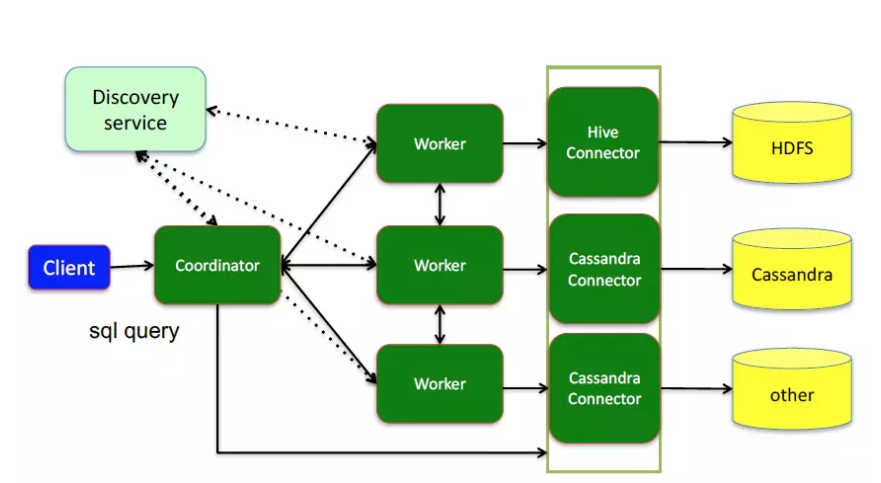
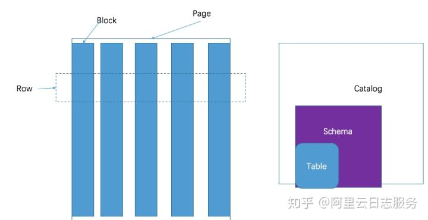
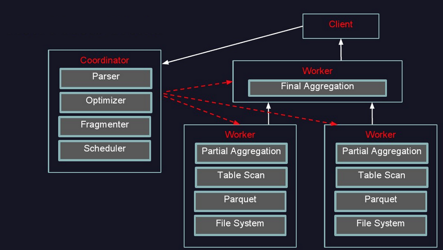
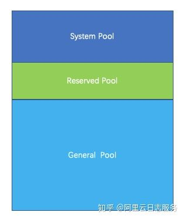

## presto 的使用场景

presto 设计的目的是为了通过分布式查询有效的查询大批量的数据，例如，查询TB或者PB级别的数据，是查询 HDFS、hive的一个可选项，但同时不局限于 HDFS, presto 适用于 OLAP 的场景。presto 并不能用来替代 mysql/pg/oracle，presto 设计的目的也不是用来处理 OLTP 场景。

## server types

coordinator: 负责解析语句、执行计划、管理 worker 节点，是 presto 的大脑；创建包含一系列 stages 查询的逻辑模型，这个模型将会被转换为一系列连接的任务运行在 presto worker 集群上； coordinators 使用 rest api 与 worker 节点通信；

worker: 负责执行任务、处理数据，worker 节点从 connectors 拉取数据并相互交换中间数据，coordinator 负责从 worker 节点获取最终结果返回给客户端；当Presto工作进程启动时，它会在协调器中向发现服务器通告自己，从而使Presto协调器可以使用它执行任务。节点之间通过 rest api 进行通信。

## data sources

connector: 适配不同的数据库，类似于数据库的 driver，是 Presto SPI 的实现，可以让 Presto 使用标准 API 与资源交互；

catalog：包含 schemas 和通过 connector 指向一个数据源

schema: 组织表的一种方式；

## Query Execution Model

Statement：Presto 执行 ANSI-compatible SQL 语句

Query：当Presto解析一个语句时，它将其转换为一个查询，并创建一个分布式查询计划，然后将其实现为一系列在Presto worker上运行的互连阶段；

stage:当Presto执行一个查询时，它将执行分解为一个stage层次结构;包含查询的阶段的层次结构类似于树。每个查询都有一个根阶段，负责聚合其他阶段的输出;阶段是 coordinators 用来对分布式查询计划建模的，但是阶段本身并不在Presto worker 上运行。

tasks：一个分布式查询计划被分解成一系列的阶段，这些阶段被转换成任务，然后对这些任务进行操作或处理拆分,Presto任务有输入和输出，正如一个阶段可以由一系列任务并行执行一样，一个任务是与一系列驱动程序并行执行的。

split: tasks 在整体 data set 的切片上操作；

driver: drivers 根据数据进行操作，并组合运算符以生成输出，然后由一个任务聚合，然后在另一个阶段传递到另一个任务。drivers 是一系列运算符实例，或者可以将 drivers 视为内存中的一组物理运算符。

Operator: An operator consumes, transforms and produces data;

Exchange: 为查询的不同阶段在Presto节点之间交换传输数据。任务将数据生成到输出缓冲区，并使用exchange client 使用其他任务的数据。

## 架构

    

## 数据模型

presto采取三层表结构：

1. catalog 对应某一类数据源，例如hive的数据，或mysql的数据
2. schema 对应mysql中的数据库
3. table 对应mysql中的表

    

presto的存储单元包括：

Page： 多行数据的集合，包含多个列的数据，内部仅提供逻辑行，实际以列式存储。  
Block：一列数据，根据不同类型的数据，通常采取不同的编码方式，了解这些编码方式，有助于自己的存储系统对接presto。

## presto 运行过程

1. coordinator接到SQL后，通过SQL语法解析器把SQL语法解析变成一个抽象的语法树AST，只是进行语法解析如果有错误此环节暴露
2. 语法符合SQL语法，会经过一个逻辑查询计划器组件，通过connector 查询metadata中schema 列名 列类型等，将之与抽象语法数对应起来，生成一个物理的语法树节点 如果有类型错误会在此步报错
3. 如果通过，会得到一个逻辑的查询计划，将其分发到分布式的逻辑计划器里，进行分布式解析，最后转化为一个个task
4. 在每个task里面，会将位置信息解析出来，交给执行的plan，由plan将task分给worker执行

    

## 低延迟原理

- 基于内存的并行计算

- 流水式计算作业

- 本地化计算
> Presto在选择Source任务计算节点的时候，对于每一个Split，按下面的策略选择一些minCandidates  
> 优先选择与Split同一个Host的Worker节点  
> 如果节点不够优先选择与Split同一个Rack的Worker节点  
> 如果节点还不够随机选择其他Rack的节点  

- 动态编译执行计划

- GC控制

## 容错

1. 如果某个worker挂了，discovery service 会通知coordinator
2. 对于query是没有容错的，一旦worker挂了，query就执行失败了，与其在这里容错不如直接执行
3. coordinator 和discovery service 的单点故障问题还没有解决

## 内存管理
Presto是一款内存计算型的引擎，所以对于内存管理必须做到精细，才能保证query有序、顺利的执行，部分发生饿死、死锁等情况。

    

Presto内存管理，分两部分：

- query内存管理：query划分成很多task， 每个task会有一个线程循环获取task的状态，包括task所用内存。汇总成query所用内存；如果query的汇总内存超过一定大小，则强制终止该query。

- 机器内存管理：coordinator有一个线程，定时的轮训每台机器，查看当前的机器内存状态。
  
当query内存和机器内存汇总之后，coordinator会挑选出一个内存使用最大的query，分配给Reserved Pool。

内存管理是由coordinator来管理的， coordinator每秒钟做一次判断，指定某个query在所有的机器上都能使用reserved 内存。那么问题来了，如果某台机器上，没有运行该query，那岂不是该机器预留的内存浪费了？为什么不在单台机器上挑出来一个最大的task执行。原因还是死锁，假如query，在其他机器上享有reserved内存，很快执行结束。但是在某一台机器上不是最大的task，一直得不到运行，导致该query无法结束。

### 内存池

Presto采用逻辑的内存池，来管理不同类型的内存需求。Presto把整个内存划分成三个内存池，分别是System Pool ,Reserved Pool, General Pool。

    

1. System Pool 是用来保留给系统使用的，默认为40%的内存空间留给系统使用。
2. Reserved Pool和General Pool 是用来分配query运行时内存的。
3. 其中大部分的query使用general Pool。 而最大的一个query，使用Reserved Pool， 所以Reserved Pool的空间等同于一个query在一个机器上运行使用的最大空间大小，默认是10%的空间。
4. General则享有除了System Pool和General Pool之外的其他内存空间。

为什么要使用系统内存池?

> System Pool用于系统使用的内存，例如机器之间传递数据，在内存中会维护buffer，这部分内存挂载system名下。

为什么需要保留区内存呢？并且保留区内存正好等于query在机器上使用的最大内存？

> 如果没有Reserved Pool， 那么当query非常多，并且把内存空间几乎快要占完的时候，某一个内存消耗比较大的query开始运行。但是这时候已经没有内存空间可供这个query运行了，这个query一直处于挂起状态，等待可用的内存。 但是其他的小内存query跑完后，又有新的小内存query加进来。由于小内存query占用内存小，很容易找到可用内存。 这种情况下，大内存query就一直挂起直到饿死。所以为了防止出现这种饿死的情况，必须预留出来一块空间，共大内存query运行。 预留的空间大小等于query允许使用的最大内存。Presto每秒钟，挑出来一个内存占用最大的query，允许它使用reserved pool，避免一直没有可用内存供该query运行。

参考：  
> https://www.jianshu.com/p/938d2a3a055c  
> https://zhuanlan.zhihu.com/p/101366898