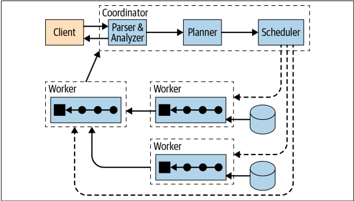
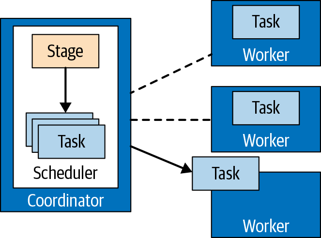

## 介绍

presto 设计的目的是为了通过分布式查询有效的查询大批量的数据，例如，查询TB或者PB级别的数据，是查询 HDFS、hive的一个可选项，但同时不局限于 HDFS, presto 适用于 OLAP 的场景。presto 并不能用来替代 mysql/pg/oracle，presto 设计的目的也不是用来处理 OLTP 场景。

## 架构图

 
    

## 节点角色

**coordinator**

负责解析语句、执行计划、管理 worker 节点，是 presto 的大脑；创建包含一系列 stages 查询的逻辑模型，这个模型将会被转换为一系列连接的任务运行在 presto worker 集群上； coordinators 使用 rest api 与 worker 节点通信；

**worker**

负责执行任务、处理数据，worker 节点从 connectors 拉取数据并相互交换中间数据，coordinator 负责从 worker 节点获取最终结果返回给客户端；当Presto工作进程启动时，它会在协调器中向发现服务器通告自己，从而使Presto协调器可以使用它执行任务。节点之间通过 rest api 进行通信。

**Discovery Service**

presto 使用服务发现来查找集群中所有的节点，每个注册到 Discovery Service 的节点周期性发送心跳信号，这可以使 coordinator 获取最新的可用 worker 节点列表，worker 发送心跳失败，Discovery Service 会触发失败检测，worker 将不会被分配任务。Discovery Service 是内置在 coordinator 节点中。

查询执行模型、查询计划、基于成本的优化

## 基于Connector 的架构

只要已有数据在使用 presto 的数据类型时，也可以以表、行、列的形式表达，connector 就可以创建，查询引擎也可以使用这些数据进行查询处理。

Presto 提供了 SPI 来实现一个 connector，通过在 connector 中实现 SPI，Presto 可以使用内部标准操作在任何数据上连接数据源和实施操作。每个 connector 都需要实现这个 API的三个部分：

- Operations to fetch table/view/schema metadata
- Operations to produce logical units of data partitioning, so that Presto can parallelize reads and writes
- Data sources and sinks that convert the source data to/from the in-memory format expected by the query engine

 
    

## Query Execution Model

当一个 SQL 语句提交给 coordinator 节点,coordinator 会接收sql 文本，解析并分析它。然后使用被称作查询计划的内部数据结构创建一个用于执行的计划。这个查询计划大体上代表了每个 SQL 语句处理数据并且返回结果所需要的步骤。

 
    

查询计划生成器使用了 metadata SPI 与 data statistics SPI 来创建查询计划。所以 coordinator 通过直接连接数据源，使用 SPI 来收集关于数据表和其他元数据。

 
    

coordinator 使用 metadata SPI 来获取表、列和字段类型信息，它们用于验证查询在语义上是否有效，并执行原始查询中表达式的类型检查和安全检查。

statistics SPI 被用来获取关于行数计数和表大小信息，从而在执行计划时实施基于成本的查询优化。

data location SPI 简化了分布式查询计划的创建。它被用来生成表内容的逻辑拆分，split 块是工作分配和并行工作的最小单位。

分布式查询计划是由一个或多个 stage 组成的简单查询计划的扩展。简单的查询计划被分割成计划片段。stage 是计划片段的运行时化身，它包含由 stage 的计划片段描述的工作的所有任务。

coordinator 拆分整个计划，使得集群中的 worker 节点能够并行处理，加速了整个查询过程。拥有多个阶段会导致创建阶段的依赖树。stage 的数量依赖于查询的复杂度。

 
    

分布式查询计划定义了查询在 presto 集群上执行的 stage 和方式。coordinator 用来进一步在 worker 之间计划和调度任务。一个 stage 由一个或多个 任务构成。

 
    

任务处理的数据单位被称为 split，split 是底层数据段的描述符，可以由工作进程检索和处理。它是并行和工作分配的单位。连接器对数据执行的特定操作取决于基础数据源。例如，hive connector 用文件的路径、offset、程度来描述 split，来表示文件的哪部分是需要被处理的。 

任务在源阶段以 pages 的形式处理数据，这是一组列格式的行。这些 pages 流向其他中间下游阶段。Pages 通过交换操作在 stages 之间转换，这是从上游 stage 的任务读取数据。

source 任务在 connector 的帮助下，使用 data source SPI 从底层数据源获取数据，这些数据以页面的形式呈现给Presto并流经引擎。Operators 根据他们的语法，处理并产生 pages。一个 task 操作的序列被称作 pipeline.

pipeline 的最后一个操作通常是放置它的 output pages 到任务的 output buffer。下游任务的交换操作消费来自上游任务 output buffer 的 pages。所有的这个操作并行发生在不同的 worker 中。

 
    

所以任务被指定到 worker 节点时，是运行时计划片段的化身。当任务被创建后，它给每一个 split 实例化一个 driver。每个 driver 是对 split 中数据操作处理的 pipeline 的实例化。一个 task 可能使用一个或多个 driver，这取决于 presto 的配置。一旦 所有的 driver 结束，数据将会传递到下一个 split，driver 和 task 将随着他们工作的结束被销毁。 

 
    

为了处理查询，协调器将使用连接器中的元数据创建 split 列表。通过使用 split 列表，协调器开始调度 worker 节点上的任务，以收集 split 中的数据。在查询执行期间，协调器跟踪可用于处理的所有 split，以及在工作线程和处理 split 上运行任务的位置。当任务完成处理并为下游处理生成更多split时，协调器将继续调度任务，直到没有 split 可供处理为止。在worker上处理完所有 split后，所有数据都可用，协调器可以将结果提供给 client。

## Query Planning

### initial plan

与命令式程序不同，用户不指定如何处理数据以获得结果。这一部分留给查询规划器和优化器来确定处理数据以获得所需结果的步骤顺序。这个步骤序列通常称为查询计划。理论上，指数数量的查询计划可以产生相同的查询结果。计划的性能变化很大，这就是Presto计划器和优化器试图确定最佳计划的地方。总是产生相同结果的计划称为等效计划。

初始化的计划充当了两个世界之间的桥梁：SQL世界及其语义规则，以及查询优化的世界。查询优化的作用是在给定Presto集群的有限资源的情况下，将初始计划转化为一个尽可能快、至少在合理时间内执行的等价计划。

## Optimization Rules

### Predicate Pushdown

Its role is to move the filtering condition as close to the source of the data
as possible. As a result, data reduction happens as early as possible during query execution.

### Cross Join Elimination

cross join(笛卡尔积)，没有 join 条件的 join 操作。Cross join elimination reorders the tables being joined to minimize the number of cross joins, ideally reducing it to zero.

### TOP N

During query execution, TopN keeps the desired number of rows in a heap data structure, updating the heap while reading input data in a streaming fashion.

## Cost-Based Optimizer

### The Cost Concept

如果没有基于成本的决策，查询计划规则将优化此查询的初始计划以生成计划。此计划仅由SQL查询的词法结构决定。 优化器只使用语法信息，因此它有时被称为语法优化器。由于查询计划仅基于查询，因此可以通过调整查询中表的语法顺序手动调整或优化查询。排序条件的简单更改会影响查询计划，从而影响查询的性能，这一事实对于SQL分析人员来说是很麻烦的。基于成本的优化器确保查询的两个变体生成相同的最优查询计划，供Presto的执行引擎处理。CPU时间、内存需求和网络带宽使用是在单个查询和并发工作负载中，有助于查询执行时间的三个维度。这些维度构成了Presto的成本。

### Cost of the Join

当使用相等条件来 join 两张表，presto 实现了 hsah join 的扩展版本。join 表的以便被称作 build side，此表用于生成以联接条件列为键的查找哈希表，另一个连接的表称为探测端。一旦查找哈希表准备就绪，将处理探测端的行，并使用哈希表在恒定时间内查找匹配的生成端行。

默认情况下，Presto使用三级哈希以尽可能并行化处理：

1. 两个连接的表都基于连接条件的值，散列分布在工作节点上。 应该匹配的行在联接条件列上具有相同的值，因此它们被分配给相同的节点. 这可以通过在这个阶段使用的节点数量来减少问题的大小。此节点级数据分配是哈希的第一级。
   
2. 在节点级别，构建端进一步分散在构建端工作线程中，同样使用散列函数。构建哈希表是一个CPU密集型的过程，使用多个线程来完成这项工作大大提高了吞吐量。

3. 每个工作线程最终生成最终查找哈希表的一个分区。每个分区本身就是一个哈希表。分区被组合成两层.

查找哈希表，这样我们就避免了探测端也分散在多个线程上。探测端仍在多个线程中进行处理，但线程将其工作分批分配，这比使用哈希函数对数据进行分区更快。

如您所见，构建端保存在内存中，以方便快速的内存数据处理。当然，内存占用也是相关联的，与构建端的大小成比例。这意味着构建端必须适合节点上可用的内存。这也意味着其他操作和其他查询可用的内存更少。这是与连接相关联的内存开销。还有网络成本。在前面描述的算法中，两个连接表都通过网络传输，以便于节点级数据分配。

基于成本的优化器可以选择哪个表应该是构建表，从而控制连接的内存成本。在某些情况下，优化器还可以避免通过网络发送其中一个表，从而减少网络带宽使用（降低网络成本）。为了完成它的工作，基于成本的优化器需要知道联接表的大小，它作为表统计信息提供。

### Table Statistics

Each table is provided by a connector. Besides table schema information and
access to actual data, the connector can provide table and column statistics.

With an estimation of the number of rows in the joined tables and, optionally, average
data size for columns, the cost-based optimizer already has sufficient knowledge
to determine the optimal ordering of the tables in our example query.
