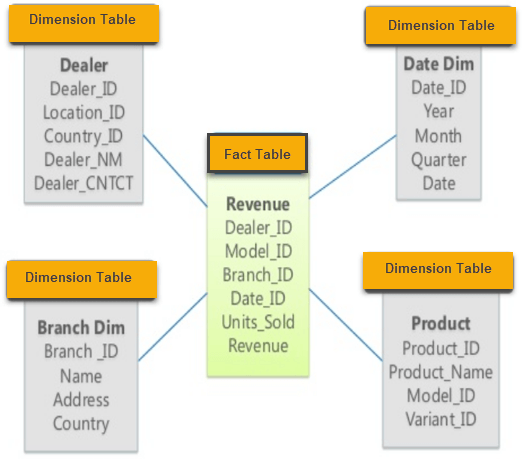
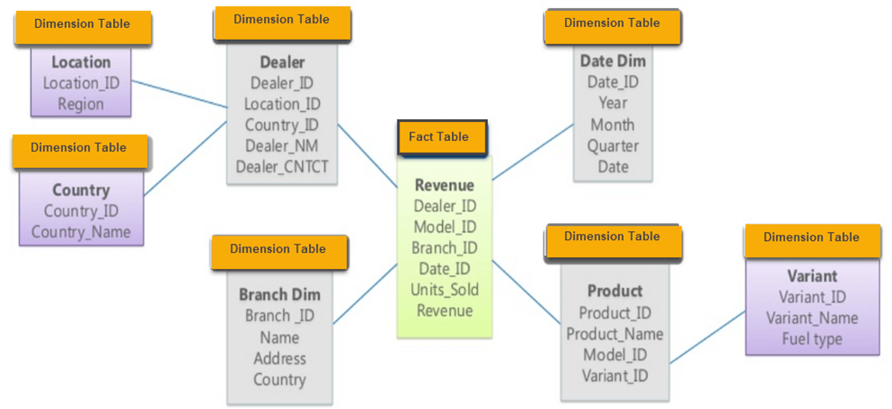

> https://www.lizenghai.com/archives/17883.html

## 星型模式

星型模式是最简单的数据仓库模式。它被称为星型模式。在星型模式中，星形的中心可以有一个事实表和相关维度表的数量。也称为Star连接模式，并且针对查询大型数据集进行了优化。

    

事实表位于中心，其中包含每个维度表的键，如Deal_ID，Model ID，Date_ID，Product_ID，Branch_ID和其他属性，如销售单位和收入。

星图的特点：

- 星型模式中的每个维度都使用唯一的一维表来表示。
- 维度表包含一组属性。
- 维度表使用外键连接到事实表
- 维度表未相互连接
- 事实表将包含键和衡量标准
- Star模式易于理解并提供最佳磁盘使用率。
- 维度表未规范化。例如，在上图中，Country_ID没有像OLTP设计那样的国家查找表。
- BI工具广泛支持该架构

## 雪花架构

Snowflake Schema是Star Schema的扩展，它增加了额外的维度。它被称为雪花，因为它的图形类似于雪花。

维度表是标准化的，它将数据拆分为其他表。在以下示例中，Country进一步标准化为单个表。

    

雪花图式的特点：

- 雪花模式的主要好处是它使用更小的磁盘空间。
- 更容易实现维度添加到架构中
- 由于多个表，查询性能降低
- 使用雪花模式时您将面临的主要挑战是，由于查找表越多，您需要执行更多维护工作。

