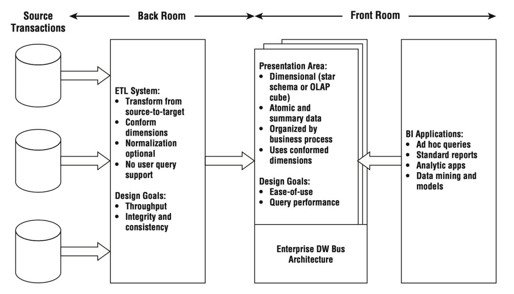
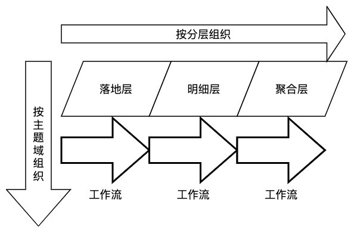

> https://blog.csdn.net/Pysamlam/article/details/105697483

## 背景

数据仓库规范首先要考虑的是分层问题以及随之而来的主题域划分。伴随着数据仓库的不断建设，数据权限、数据字典，任务资源分配等需求都浮出水面。

## 数仓的分层

    

`分层是为了解决 ETL 任务及工作流的组织、数据的流向、读写权限的控制、不同需求的满足等各类问题。`

**ODS 落地层**

落地层 (Staging Area) 最初是作为介于业务源数据和数据仓库 ETL 之间的缓冲区而存在的。在 Hive 里它表现为一个独立的库，所有来自业务方的表都会先落到这个库里。

有赞的 ODS 落地层解决了两个问题：

1. `导表的冲突`: 由于数据源有各种各样的库，源表表名重复是很正常的情况。因此我们需要给每个表加上主题域前缀，从而避免来自不同主题域的同名表之间的冲突。当同一主题域下出现同名表时，我们辅以额外的表后缀来区分; 落地层解决了统一导表的落地问题，也承担着全局 ETL 中的第一轮 Extract。我们的原则是使落地层里的数据和业务数据保持一致，这也是为了方便将来数据问题的排查与核对。

2. `数仓建设和业务需求之间的矛盾`：当时我们的人力完全无法满足众多需求方对数据的需求——数据中间层的建设赶不上飞速奔跑的业务需求。于是，一个折中的方法是让业务方直接使用落地层，自行处理一些不跨主题域的需求。这里有业务方非常熟悉的原始表，他们能非常迅速地获得所需要的数据。这也有利于快速、低成本地进行一些数据方面的探索和尝试。

**DW 数仓层**

    

`从业务层面看，数据仓库的核心是展现层和提供优质的服务。ETL 及其规范、分层等所做的一切都是为了一个更清晰易用的展现层。`

基于维度建模的总线架构 (Bus Architecture) 理论，承载一致性维度 (conformed dimension) 的维度层是独立于事实并贯穿于数仓层全局的。

除此之外，我们提供了两种类型的事实表：明细表和聚合表。因此在我们的数仓层里，还会有明细层和聚合层。我们为明细层保留的关键字是 DWS (Data Warehouse Service)，从这里开始，我们的表要承担起对外提供服务的职责。我们为聚合层保留的关键字是 DWA (Date Warehouse Aggregation)。

最后，在我们生产明细表和聚合表的时候，不可避免地会产生许多中间结果。所有这些中间结果并不承担对外提供服务的职责——它们对数据仓库的使用者是不可见的。我们为此单独设计了一个临时层来存放数仓层加工过程中可能产生的各种结果。临时层是在 Hive 上额外开辟的一个数据仓库开发人员专用的库。它承担了数据生产过程中问题数据的跟踪，也是数据存储清理时优先考虑的一块空间。

    

**DM 数据集市层**

数据集市层 (Data Mart) 根据主题域的不同在物理上进行划分——它表现为多个相互独立的库，各个数据集市之间不允许做数据依赖。每个数据集市可以由该主题域的使用方在数据仓库规范下自行开发和建设。

这一层可以根据使用习惯，建立一些宽表。但是如果要配合 Kylin 使用的话，依然建议保持星型模型——它能最大限度的发挥 Kylin 预聚合的优势。

## 命名规范

**表命名规范**

 | 分层数据库 | 表命名规范                             |
 | ---------- | -------------------------------------- |
 | ODS 落地层 | 主题域_原表名[_可选的后缀]             |
 | 明细层     | dws_主题域[_可选的二级主题域]_相关描述 |
 | 聚合层     | dwa_主题域_聚合维度                    |
 | 通用维度层 | dim_通用维度相关描述                   |

**字段命名规范**

同名同义性是我们对字段命名的首要要求。如果两个字段名字一样，那么它们的含义应该是一样的；反之，如果两个字段名字不一样，那么它们的含义就一定是要有区别的。当这个要求放在单个主题域内的时候，还是容易实现的。当它推广到全域范围内，这个事情就会变得有些困难。

**任务命名及工作流组织规范**

任务是组成工作流的最小单位，也是完成一次 ETL 的最小开发单位，同时也是调度任务进行失败重试的最小单元。我们要求一个任务只写一张目标表，同时任务的命名中必须包含该目标表的表名。

工作流是一次调度应用的最小单元，它将一组具有相关性的共同调度频率的任务组织在一起。

在没有工作流组织规范之前，我们的工作流组织因人而异显得五花八门。杂乱的工作流同样不利于数据仓库的管理和维护。于是我们将同一主题、同一分层且同一调度周期的任务组织成一个工作流。

    

