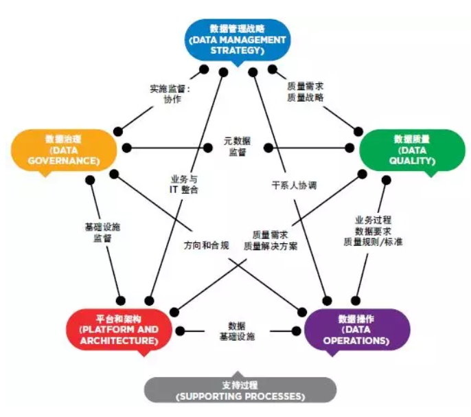
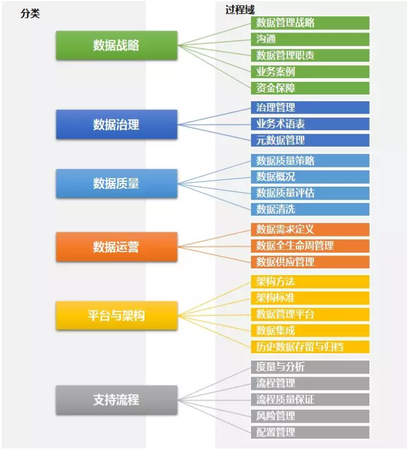
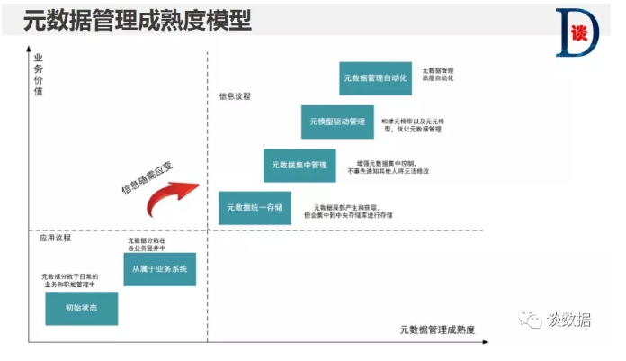
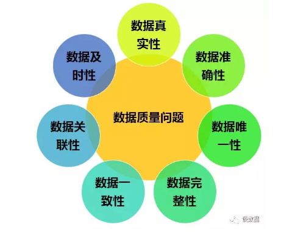

# 数据治理

## 理论模型

**国外的研究成果**

国外对于数据管理成熟度的研究起步比较早，在数据管理、数据治理、主数据管理等都方面都形成了一些优秀的研究成果，可以作为企业评估数据管理能力成熟度的重要参考。国外关于数据管理能力成熟度的评估模型有：

- CMMI DMM 数据管理能力成熟度模型
- EDM DMM 数据管理能力成熟度模型
- MD3M 主数据管理成熟度模型
- DataFlux 主数据管理成熟度模型
- Oracle MDM主数据管理能力成熟度模型
- DCAM 数据管理能力成熟度模型
- IBM 数据治理能力成熟度模型
- Microsoft IT微软数据管理能力成熟度
- DSCMM 数据安全能力成熟度模型
- 美国联邦政府FGDMM数据成熟度模型
- 斯坦福数据治理成熟度模型

**国内研究成果**

2014年，全国信息技术标准化技术委员牵头，御数坊、清华大学、建设银行、光大银行等单位组成工作组进行《数据能力成熟度评价模型》的制定工作。在制定的过程中充分吸取了国内先进行业的发展经验，结合了国际上DAMA（国际数据管理协会）《数据管理知识体系指南DMBOK》中的内容。数据能力成熟度评价模型（Data Capability Maturity Model 简称 DCMM）已形成国内关于数据能力成熟度模型的一项国家标准。

### DMM内容及面向对象

数据管理成熟度（DMM）模型提供了帮助组织建立、改进和衡量其企业数据管理能力，允许及时、准确以及整个组织中的可访问数据。DMM的编制主要参考了大量金融行业数据管理案例，在这些案例的基础之上进行了提炼和总结，并参照CMMI成熟度模型，为数据管理定义出`25个过程域，5个能力等级`。

**DMM 数据管理能力成熟度等级**

1. Performed（已执行级） 
主要特点：数据作为项目实施的需求进行管理。 
解读分析：这个阶段，企业和组织的数据管理过程是临时性的，主要在项目级别执行。没有形成跨业务领域数据管理流程，数据管理过程是被动的，例如，对于数据质量的修复。关于数据管理的基本改进可能存在，但改进尚未在企业或组织范围内进行明确、宣贯和推广。

2. Managed（可管理级） 
主要特点：企业意识到数据作为企业关键资产的重要性，局部实现了常态化管理。 
解读分析：这个阶段，数据资产化的观念被企业或组织所认可，企业尝试并开展了数据管理的相关工作。按照企业的目标制定了相关政策和执行过程，雇佣有专业知识的数据管理人员来对数据进行管理，使得核心数据能够受控输出；数据管理在企业局部范围开展，涉及部分业务部门或利益相关者；部分数据开始进行数据的监控、控制和过程审查，估过程是否符合其数据管理的要求。

3. Defined （可定义级） 
主要特点：数据在组织级被视为关键生产要素。 
解读分析：随着时间的推移，数据已经被企业视为除了人员、资金和物资的第四种生产要素。企业内部已经建立和改进了一些数据管理的流程，改进了数据质量。根据企业的数据战略和指导方针，从一组标准的数据管理过程中能够定制满足企业特定需求的数据管理方法，并赋以执行。

4. Measured （可度量级） 
主要特点：数据被视为竞争优势的来源分析。 
解读分析：这个阶段，企业已基本建立起可预测和度量数据的指标体系，以提升数据质量。对不不同类别的数据启动有差异的管理流程，企业使用了元数据管理、数据质量管理、主数据管理等应用，对数据的业务含义、业务规则、质量规则进行了统一的描述，在公司范围内形成一致性的理解，并在整个数据的生命周期中进行管理。

5. Optimized（优化管理级） 
主要特点：在一个充满活力和竞争的市场中，数据被视为生存的关键，持续提升和优化。 
解读分析：通过创新性的改进，企业数据管理能力不断提高。通过数据管理能力的增强反馈用于推动业务增长和决策能力的提升，企业的数据管理能力已经发展成为行业的标杆，可以在整个行业内进行先进经验的分享。

**DMM 架构和过程域**

DMM模型提供了数据管理的最佳实践路线图，帮助组企业构建、改进和衡量其企业数据管理能力。该模型围绕着数据管理成熟度（DMM）模型展开，该模型是一个综合的数据管理实践框架，分为六个关键类别，帮助组织对其能力进行基准评测，找出优势和差距，并利用其数据资产提高业务绩效。

    

DMM模型包括25个过程域，由20个数据管理过程域和5个支持过程域组成，按管控维度不同分为：数据战略、数据治理、数据质量、数据运营、平台与架构、支撑流程6个类型，如下图所示：

    

## 元数据管理

> https://mp.weixin.qq.com/s/0-k5PYkUCU1HCZCBPIWiAw

根据数据的性质特点，业内一般将元数据划分为三类：`业务元数据、技术元数据和管理元数据`。

`业务元数据`是描述数据的业务含义、业务规则等。通过明确业务元数据让人们更容易理解和使用业务元数据，元数据消除了数据二义性，让人们对数据有一致的认证，避免“各说自话”，进而为数据分析和应用提供支撑。常见的业务元数据包括：业务定义、业务术语、业务规则、业务指标等。

`技术元数据`是对数据的结构化，方便计算机或数据库之间对数据进行识别、存储、传输和交换。技术元数据可以服务于开发人员，让开发人员对数据的存储、结构更明确，从而为应用的开发和系统的集成奠定基础。技术元数据也可服务于业务人员，通过元数据理清数据关系，让业务人员能够更快速的找到想要的数据，进而对数据的来源去向进行分析，支持数据血缘追溯和影响分析。常见的技术元数据包括：存储位置、数据模型、数据库表、字段长度、字段类型、ETL脚本、SQL脚本、接口程序、数据关系等。

`管理元数据`描述了数据的管理属性，包括管理部门、管理责任人等，通过明确管理属性，有利于数据管理责任到部门和个人，是数据安全管理的基础。常见的管理元数据包括：数据所有者、数据质量定责、数据安全等级等。

    

在实施元数据管理的过程中，可以参照元数据管理的成熟度模型确定企业当前元数据管理所在层次，并根据业务需要制定路线图实现元数据管理水平的提升。下图是元数据管理成熟度模型：

    

## 数据质量管理

> https://mp.weixin.qq.com/s/ovSa7Uhv5IyKzyb-l3PHaA

数据质量管理是对数据从计划、获取、存储、共享、维护、应用、消亡生命周期的每个阶段里可能引发的数据质量问题，进行识别、度量、监控、预警等一系列管理活动，并通过改善和提高组织的管理水平使得数据质量获得进一步提高。数据质量管理的终极目标是通过可靠的数据提升数据在使用中的价值，并最终为企业赢得经济效益。

    

### 数据质量问题根因分析

**技术方面**

- 数据模型设计的质量问题，例如：数据库表结构、数据库约束条件、数据校验规则的设计开发不合理，造成数据录入无法校验或校验不当，引起数据重复、不完整、不准确。

- 数据源存在数据质量问题，例如：有些数据是从生产系统采集过来的，在生产系统中这些数据就存在重复、不完整、不准确等问题，而采集过程有没有对这些问题做清洗处理，这种情况也比较常见。

- 数据采集过程质量问题， 例如：采集点、采集频率、采集内容、映射关系等采集参数和流程设置的不正确，数据采集接口效率低，导致的数据采集失败、数据丢失、数据映射和转换失败。

- 数据传输过程的问题，例如：数据接口本身存在问题、数据接口参数配置错误、网络不可靠等都会造成数据传输过程中的发生数据质量问题。

- 数据装载过程的问题，例如：数据清洗规则、数据转换规则、数据装载规则配置有问题。

- 数据存储的质量问题，例如：数据存储设计不合理，数据的存储能力有限，人为后台调整数据，引起的数据丢失、数据无效、数据失真、记录重复。

- 业务系统各自为政，烟囱式建设，系统之间的数据不一致问题严重。

**业务方面**

- 业务需求不清晰，例如：数据的业务描述、业务规则不清晰，导致技术无法构建出合理、正确的数据模型。

- 业务需求的变更，这个问题其实是对数据质量影响非常大的，需求一变，数据模型设计、数据录入、数据采集、数据传输、数据装载、数据存储等环节都会受到影响，稍有不慎就会导致数据质量问题的发生。

- 业务端数据输入不规范，常见的数据录入问题，如：大小写、全半角、特殊字符等一不小心就会录错。人工录入的数据质量与录数据的业务人员密切相关，录数据的人工作严谨、认真，数据质量就相对较好，反之就较差。

- 数据作假，对，你没看错，就是数据作假！操作人员为了提高或降低考核指标，对一些数据进行处理，使得数据真实性无法保证。

**管理方面**

- 认知问题。企业管理缺乏数据思维，没有认识到数据质量的重要性，重系统而轻数据，认为系统是万能的，数据质量差些也没关系。

- 没有明确数据归口管理部门或岗位，缺乏数据认责机制，出现数据质量问题找不到负责人。

- 缺乏数据规划，没有明确的数据质量目标，没有制定数据质量相关的政策和制度。

- 数据输入规范不统一，不同的业务部门、不同的时间、甚至在处理相同业务的时候，由于数据输入规范不同，造成数据冲突或矛盾。

- 缺乏有效的数据质量问题处理机制，数据质量问题从发现、指派、处理、优化没有一个统一的流程和制度支撑，数据质量问题无法闭环。

- 缺乏有效的数据管控机制，对历史数据质量检查、新增数据质量校验没有明确和有效的控制措施，出现数据质量问题无法考核。

